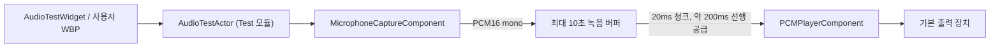

<!-- Copyright (c) 2026 Prayslaks. SPDX-License-Identifier: MIT -->

# 범용 음성 입출력과 UMG 테스트

> 부분 갱신 일자: 2026-09-26 — JWNetworkUtilityAudio 분리, 범용 컴포넌트와 로컬 녹음·재생 UMG 패널 추가.

## 바로 테스트하기

OpenAI 키, Live 컴포넌트, Python 서버가 필요 없다. 모듈·클래스가 이동했으므로 빌드 후 에디터를 재시작한다.

1. 레벨에 **JWNU Audio Test Actor**를 배치한다. C++ Classes → JWNetworkUtilityTest에서 찾거나 Actor 배치 검색을 사용한다. 이 Actor에 마이크·재생 컴포넌트가 이미 들어 있다.
2. Level BP에 배치한 Actor 참조를 만든다.
3. BeginPlay → Actor의 **Show Test Panel**을 호출한다. Player Controller에는 **Get Player Controller(0)**를 연결한다.
4. 같은 Player Controller에서 **Set Show Mouse Cursor = true**, **Set Input Mode Game and UI**를 호출한다. Widget to Focus에는 Show Test Panel의 반환값을 연결한다.
5. PIE 실행 → **녹음 시작** → 말하기 → **녹음 정지** → **녹음 재생** 순서로 누른다.

기본 패널은 C++로 구성한 실제 UMG 위젯 `UJWNU_AudioTestWidget`이다. WBP 에셋을 별도로 만들 필요는 없다. ShowTestPanel은 화면에 패널만 추가하며 입력 모드와 커서 설정은 변경하지 않는다. 패널을 제거하거나 테스트를 끝내면 녹음·재생을 중단한다.

표시 내용은 입력 음량, 녹음 시간, 재생 위치, 오류다. 입력 막대는 RMS를 -60~0 dBFS 범위로 변환한다. 마이크는 버튼을 누를 때만 열린다. 녹음과 재생은 동시에 하지 않는다.

Actor Details 기본값:

| 설정 | 기본값 | 의미 |
| --- | --- | --- |
| Recording Sample Rate | 24000 | 저장할 PCM의 표본율 |
| Microphone Device Index | -1 | 시스템 기본 마이크 |
| Max Recording Seconds | 10 | 0.1~10초. 도달하면 자동 정지 |

새 녹음을 성공적으로 시작하면 이전 녹음을 지운다. 녹음은 메모리에만 있으며 파일로 저장하지 않는다. 장치 열기 실패 시 기존 녹음은 보존한다. UI의 재생 위치는 소프트웨어 큐 소비 기준이므로 스피커가 실제 소리를 낸 시점과 장치 지연만큼 차이 날 수 있다.

## 직접 만든 WBP에서 제어하기

WBP에 `JWNU_AudioTestActor` 참조 변수를 두고 **Instance Editable / Expose on Spawn**을 켠다. Create Widget 때 레벨에 배치한 Actor를 전달한다. 기본 패널 대신 다음 함수들을 연결한다.

| UMG 요소 | Actor API |
| --- | --- |
| 녹음 시작 버튼 | StartRecording |
| 녹음 정지 버튼 | StopRecording |
| 재생 버튼 | PlayRecording |
| 재생 정지 버튼 | StopPlayback |
| 상태 표시 | GetTestState → Idle / Recording / Playing |
| 녹음 길이 | GetRecordedSeconds |
| 재생 위치 | GetPlaybackSeconds |
| 입력 음량 | GetInputLevel, 0~1 RMS |
| 오류 표시 | OnError 또는 GetLastError |

자체 WBP의 Destruct에서도 StopRecording/StopPlayback을 호출한다. Actor는 EndPlay에서도 정리한다. 녹음·재생 중 다른 시작 요청은 false로 거절한다. 재생 종료 뒤 다시 PlayRecording하면 처음부터 재생한다.

## 구성과 책임



| 모듈 | 소유 기능 |
| --- | --- |
| JWNetworkUtilityAudio | 장치 캡처, PCM 변환, 재생, 범용 오디오 타입 |
| JWNetworkUtilityOpenAI | OpenAI 세션·이벤트. LiveComponent가 범용 오디오를 연결 |
| JWNetworkUtilityTest | 녹음 버퍼, 재생 공급, 테스트 Actor와 UMG 패널 |

Audio 모듈은 JWNU 네트워크 모듈이나 OpenAI 모듈에 의존하지 않는다. 의존성은 Core/CoreUObject/Engine과 클라이언트용 엔진 오디오 모듈이다. Windows에서 엔진 AudioCaptureCore·AudioCaptureWasapi·SignalProcessing을 사용하며 Server 타깃에서는 이 세 의존성과 캡처 구현을 제외한다. 현재 장치 검증 대상은 Win64 UE 5.7이다.

## 범용 컴포넌트 API

`UJWNU_MicrophoneCaptureComponent`:

- StartCapture(SampleRate, DeviceIndex), StopCapture(), IsCapturing()
- OnPCM / OnPCMNative: 20ms 단위 PCM16 mono little-endian
- GetInputLevel(): 가장 최근 청크의 RMS. 정지하면 0
- GetCaptureDevices(): 장치 인덱스·이름·채널 수·권장 표본율 조회. 녹음을 시작하지 않음
- OnError / OnErrorNative: `FJWNU_AudioError`

`UJWNU_PCMPlayerComponent`:

- StartPlayer(SampleRate): 재생기 준비
- QueuePCM(PCM16): 순서대로 청크 접수. 첫 청크부터 재생
- StopPlayer(): 남은 큐를 버리고 즉시 정지
- GetBufferedSeconds(): 아직 소비하지 않은 PCM 길이
- OnError / OnErrorNative: `FJWNU_AudioError`

두 컴포넌트 모두 Actor에 등록한 뒤 게임 스레드에서 호출한다. 입력 장치 콜백은 UObject를 만지지 않으며 BP/C++ 이벤트는 게임 스레드로 전달한다. 오디오 오류는 Code/Message/bFatal을 가진다. API 응답 식별자 등 Provider 정보는 없다.

지원 출력 표본율은 **8000, 16000, 22050, 24000, 32000, 44100, 48000, 96000 Hz**다. 현재 데이터 형식은 **PCM16 mono little-endian**으로 고정이다. WAV 헤더·압축 음성·stereo PCM을 QueuePCM에 직접 넣지 않는다. 마이크의 원본 다채널 float 입력은 mono로 혼합하고 엔진 선형 리샘플러로 변환한다. 고품질 대역 제한 필터, AEC, AGC, 노이즈 억제는 제공하지 않는다.

마이크 큐는 250ms, 플레이어 큐는 2초 상한이다. 5초간 캡처 샘플이 오지 않거나 첫 버퍼 이후 장치 discontinuity가 발생하면 캡처를 중단하고 오류를 보낸다. StopCapture는 아직 이벤트로 전달하지 않은 장치 버퍼를 버린다.

테스트 Actor는 녹음 전체를 QueuePCM에 한 번에 넣지 않는다. Tick마다 소비량을 확인하면서 20ms씩 공급해 약 200ms의 여유만 유지한다. 5초간 재생 큐가 줄지 않으면 출력 장치 오류를 표시하고 정지한다. LoadRecordingPCM(PCM16, SampleRate)으로 외부·합성 PCM을 가져올 수도 있으며, Idle에서 최대 10초만 허용한다.

## Live와의 연결

`UJWNU_OpenAILiveComponent`의 StartLive/StopLive 사용법은 동일하다. 내부에서 새 범용 컴포넌트를 생성한다. Live 세션의 16/24kHz 제한은 OpenAI 세션에만 남아 있다. 일반 오디오 오류는 LiveComponent에서 OpenAI용 오류 타입으로 변환하므로 기존 Live OnError 이벤트의 타입은 바뀌지 않는다.

직접 연결할 때는 Microphone.OnPCM → Session.AppendInputAudio, Session.OnAudio → Player.QueuePCM을 연결한다. 입력·세션·출력 표본율은 동일하게 맞춘다.

## 기존 BP / C++ 이름 이전

| 이전 | 현재 |
| --- | --- |
| UJWNU_OpenAIMicrophoneComponent | UJWNU_MicrophoneCaptureComponent |
| UJWNU_OpenAIAudioPlayerComponent | UJWNU_PCMPlayerComponent |
| JWNetworkUtilityOpenAI의 오디오 구현 | JWNetworkUtilityAudio |

플러그인 Config/DefaultJWNetworkUtility.ini에 클래스 CoreRedirect를 등록한다. 기존 컴포넌트의 직렬화된 클래스 참조가 새 클래스로 연결된다. C++ include와 Build.cs 의존성은 새 이름으로 바꾼다.

기존 **독립 오디오 컴포넌트**의 OnError 이벤트 핀은 OpenAILiveError에서 AudioError로 바뀌므로 해당 노드는 Refresh/Reconstruct 후 오류 구조체 연결을 갱신해야 한다. 자동 에셋 재저장은 하지 않는다. LiveComponent 자체와 그 OnError 핀은 그대로다.

## 자동 검증과 구현 위치

```powershell
uv run --locked --project Plugins/JWNetworkUtility/TestServer python Plugins/JWNetworkUtility/TestServer/run_audio_tests.py --engine "C:/Program Files/Epic Games/UE_5.7" --project "C:/Users/prays/Documents/Unreal Projects/ProjectZK/ProjectZK.uproject"
```

서버나 API 키 없이 UnrealEditor-Cmd의 `JWNetworkUtility.Audio` 테스트를 실행한다. 실제 마이크를 열지 않으며, -nosound에서 합성 PCM을 소비해 긴 녹음의 순서·끝 청크·큐 상한·자동 종료·재생/정지 UMG 버튼·클래스 redirect를 검증한다. 결과는 Saved/Automation/JWNUAudio-*에 저장한다.

실제 Windows 마이크 권한·장치 선택·스피커 소리는 위 PIE 테스트로 확인한다. Live 회귀는 기존 run_live_tests.py로 별도 실행한다.

2026-09-26 검증: Editor/Game Win64 Development 빌드, Audio PCM/UMGWorkflow 2개 테스트, Live 통합 16개 시나리오 통과. 오디오 보고서는 `Saved/Automation/JWNUAudio-20260926-000057/index.json`, Live 회귀 보고서는 `Saved/Automation/JWNUOpenAILive-20260926-000450/index.json`이다. 기존 설정 파일 경로 정규화 경고가 있으며 실패는 없다. 실제 마이크·스피커는 자동 테스트에서 사용하지 않았다.

- [마이크 컴포넌트](../Source/JWNetworkUtilityAudio/Public/JWNU_MicrophoneCaptureComponent.h)
- [PCM 플레이어](../Source/JWNetworkUtilityAudio/Public/JWNU_PCMPlayerComponent.h)
- [오디오 타입](../Source/JWNetworkUtilityAudio/Public/JWNU_AudioTypes.h)
- [테스트 Actor](../Source/JWNetworkUtilityTest/Public/JWNU_AudioTestActor.h)
- [기본 UMG 패널](../Source/JWNetworkUtilityTest/Public/JWNU_AudioTestWidget.h)
- [OpenAI Live 가이드](OpenAILive.md)
