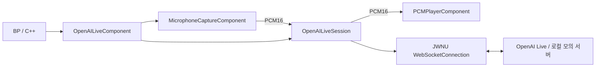

<!-- Copyright (c) 2026 Prayslaks. All rights reserved. Unauthorized copying, modification, or distribution of this file, via any medium is strictly prohibited. Proprietary and confidential. -->

# OpenAI GPT-Live — C++ / Blueprint

> 부분 갱신 일자: 2026-09-26 — Deprecated 호환 함수 10개와 삭제된 Evaluate의 핀 리다이렉트를 제거. 이전 함수 노드는 현재 생성·바인딩·Start 규약으로 교체한다.

> 부분 갱신 일자: 2026-09-26 — 세션·컴포넌트 Start 계열의 Options 미연결 시 기본 구조체 참조를 자동 생성.

> 부분 갱신 일자: 2026-09-26 — 세션·컴포넌트 직접 키 입력의 BP 표시명을 API Key로 통일.

> 부분 갱신 일자: 2026-09-26 — Create OpenAI Live Session·Start·Close·Cancel로 공개 이름 통일. 이전 이름의 호환 노드는 제거. [공통 요청 규약](RequestLifecycle.md).

> 부분 갱신 일자: 2026-09-25 — OpenAI 모듈, 세션·마이크·재생 컴포넌트, 로컬 프로토콜 테스트 추가.

> 부분 갱신 일자: 2026-09-26 — 오디오를 JWNetworkUtilityAudio로 분리. [독립 UMG 녹음·재생 테스트](Audio.md).

## 범위와 구조

기존 JWNetworkUtility 플러그인 안의 `JWNetworkUtilityOpenAI` Runtime 모듈이다. 다른 Provider에 대한 공통 AI 추상화는 만들지 않는다. 하위 `JWNetworkUtility`는 HTTP/SSE/WebSocket을, 새 모듈은 OpenAI의 세션 설정·이벤트·음성 연결을 담당한다.



`OpenAILiveSession`은 오디오 장치를 참조하지 않는다. 나중에 데디 서버에서 세션만 만들고 클라이언트에서 받은 PCM을 전달할 수 있다. 게임 RPC·중계 서버·인증 토큰 발급은 이 모듈의 범위 밖이다. 현재는 Windows UE 5.7에서 검증한다. Server 타깃에서는 AudioCaptureCore·SignalProcessing·AudioCaptureWasapi 의존성과 캡처 구현을 제외한다.

## BP로 실제 API 테스트

1. 새 모듈을 로드하도록 **빌드 후 에디터를 재시작**한다. 별도 플러그인 활성화나 기존 HTTP HostProvider 설정은 필요 없다.
2. Actor BP에 **JWNU Open AI Live Component**를 추가한다. 검색 시 `OpenAI` 또는 `JWNU`로 찾을 수 있다.
3. `On Ready`, `On Transcript`, `On Error`, `On Closed` 이벤트를 연결한다.
4. 버튼/입력 이벤트에서 **Start from Environment**를 호출한다. 세션·컴포넌트의 **Start**와 **Start from Environment**는 `AutoCreateRefTerm="Options"`를 적용하므로 Options를 연결하지 않으면 기본값을 사용한다. 설정을 바꾸려면 **Make JWNU Open AI Live Options**를 연결한다.
5. `On Ready` 이후 말한다. 기본값에서는 마이크 입력과 응답 재생이 자동으로 연결된다.
6. 종료 버튼에서 **Close**를 호출한다. `On Closed`까지 기다린다. 다시 시작하려면 다음 Tick/다음 입력에서 Start를 호출한다.

컴포넌트는 BeginPlay에서 자동 실행하지 않는다. 멀티플레이에서는 로컬 플레이어의 BP에서만 시작해야 한다. 컴포넌트나 세션은 복제되지 않는다.

기본 옵션:

| 필드 | 기본값 / 의미 |
| --- | --- |
| Endpoint | `wss://api.openai.com/v1/live/sessions` |
| Model | `gpt-live-1` |
| Backend Model | `gpt-5.6-luna`, Responses delegation |
| Instructions | 한국어로 간결하게 대화하세요. |
| Voice | `marin` |
| Sample Rate | 24000. 16000도 지원 |
| Start / Close Timeout | 20초 / 15초 |
| Safety Identifier | 필요 시 앱이 제공하는 사용자 식별 문자열 |

`Use Microphone`, `Play Audio`는 시작 시 읽는다. 기본 마이크 장치는 `Microphone Device Index = -1`이다. 헤드폰으로 먼저 테스트한다. 현재 캡처 경로에는 소프트웨어 AEC·노이즈 억제·AGC가 없으므로 스피커 출력이 마이크로 되돌아갈 수 있다.

### 키 전달

개발용 직접 연결은 **에디터 프로세스가 상속한 `OPENAI_API_KEY`**를 사용한다. Windows 사용자 환경변수로 설정했다면 에디터와 에디터를 실행하는 부모 프로세스도 다시 시작해야 한다. 플러그인은 키를 설정 USTRUCT·에셋·로그에 저장하지 않는다. BP에 키 리터럴을 넣지 않는다.

`Start` / 세션의 `Start`는 런타임에서 직접 제공한 API 키도 받는다. `Start ... from Environment`는 기본 공식 주소만 허용하므로 환경변수의 키가 커스텀 테스트 주소로 전송되지 않는다. 일반 키를 배포 클라이언트에 포함하지 않는다. 제품용 클라이언트 인증과 중계 방식은 별도 구성해야 한다.

### 이벤트 배선 예

| 이벤트 | BP 처리 |
| --- | --- |
| On Ready(Session Id) | 상태 표시를 “대화 중”으로 변경 |
| On Transcript(Transcript) | Break struct → bInput으로 화자 구분 → Delta를 기존 문자열 뒤에 그대로 Append |
| On Audio(PCM16) | 출력 관찰/사용자 재생 경로. 기본 자동 재생과 중복 재생하지 않는다 |
| On Error(Error) | Code·Message 표시. bFatal=false면 명령 하나의 오류이며 세션은 계속 동작 |
| On Usage(Seconds) | 누적값을 덮어쓴다. 합산하지 않는다 |
| On Raw Event(Type, Json) | 세부 명령 응답·미래 이벤트를 기존 JSON→USTRUCT 노드로 해석 |
| On Closed(Info) | bFinalized 및 Usage Seconds 확인 후 UI 종료 |

Transcript의 Start/End Milliseconds는 세션 기준 시간이다. 음성이 끝났다는 이벤트나 재생 완료를 뜻하지 않는다. RawEvent에는 `response.event` 등 중첩 백엔드 이벤트도 전달한다. 초기 버전은 백엔드 모델만 지정하며 도구 자동 실행기를 제공하지 않는다.

## 로컬 모의 서버로 먼저 테스트

프로젝트 루트에서:

```powershell
cd Plugins/JWNetworkUtility/TestServer
uv sync --locked
uv run uvicorn main:app --host 127.0.0.1 --port 5000 --reload
```

Options.Endpoint를 `ws://127.0.0.1:5000/live/sessions`로 바꾸고 **Start**에 **빈 API Key**를 넣는다. 환경변수 노드를 쓰지 않는다. 서버는 PCM을 에코하고 고정 한국어 자막과 누적 사용량을 보낸다. OpenAI 호출·과금·음성 인식은 없다. 반환된 에코가 다시 마이크로 들어가지 않도록 헤드폰을 사용한다.

마이크 없이 프로토콜만 확인하려면 컴포넌트의 Use Microphone / Play Audio를 끄고, On Ready → Get Session → Append Input Audio에 합성 PCM을 전달한다. 24kHz에서 20ms 무음은 960바이트의 0 배열이다. 20ms Timer로 보내고 종료 시 Timer도 해제한다.

## 세션만 사용하는 C++ / BP

호스트 Build.cs에 `JWNetworkUtilityOpenAI` 의존성을 추가한다. BP는 별도 Build.cs 수정이 필요 없다.

```cpp
#include "JWNU_OpenAILiveSession.h"

// Session은 소유 객체의 UPROPERTY 멤버다.
Session = UJWNU_OpenAILiveSession::CreateOpenAILiveSession(this);
if (Session)
{
    Session->OnReadyNative.AddUObject(this, &UMyComponent::HandleReady);
    Session->OnAudioNative.AddUObject(this, &UMyComponent::HandleAudio);
    Session->OnErrorNative.AddUObject(this, &UMyComponent::HandleError);
    Session->OnClosedNative.AddUObject(this, &UMyComponent::HandleClosed);
    Session->StartFromEnvironment(FJWNU_OpenAILiveOptions{});
}
```

동일한 BP 경로는 **Create OpenAI Live Session → 변수 저장 → Bind Event → Start**다. 세션 함수의 false는 접수 실패이며, 시작 설정 실패 시 OnError/OnClosed가 호출 안에서 발생할 수도 있다. 반드시 시작 전에 바인딩한다.

세션의 주요 API:

| 함수 | 계약 |
| --- | --- |
| AppendInputAudio | Ready에서만 가능. PCM16 mono little-endian, 짝수 바이트, 청크당 최대 100ms |
| SetInputMuted | 서버 mute/unmute 요청. OnRawEvent의 muted/unmuted와 client_event_id로 수락 확인 |
| AppendInstructions | session.instructions.append, 세션 전체 delegation_id=null. Content 최대 500토큰은 호출자가 준수 |
| SendEventJson | Ready에서 JSON 명령 확장. start/close/input_audio.append는 전용 함수만 허용 |
| Close | 정상 종료 요청. Connecting/Starting에서는 취소 |
| Cancel | 즉시 중단. 최종 사용량을 받지 못할 수 있음 |

SetInputMuted는 서버 명령이며 로컬 마이크 장치를 끄지 않는다. 장치 제어가 필요하면 독립 `MicrophoneCaptureComponent`의 StartCapture/StopCapture와 OnPCM을 사용한다. `PCMPlayerComponent`의 StartPlayer/QueuePCM/StopPlayer는 별도 재생 경로를 제공한다.

모든 공개 호출과 델리게이트는 게임 스레드에서 사용한다. 성공적으로 시작한 활성 세션은 GameInstanceSubsystem이 GC로부터 보관한다. Idle/종료 세션은 호출자가 참조를 보관해야 한다. 핸들은 일회용이며 재연결은 새 세션으로 한다. 편의 컴포넌트는 다음 Start 때 새 세션을 만든다.

## 동작·오류·수명

`Connecting → Starting → Ready → Closing → Closed`. 치명적 오류는 Failed로 끝난다. 연결 성공과 session.started는 별개다. Close는 session.close 전송 후 session.closed를 기다리고, 그 뒤 WebSocket을 닫는다. 소켓을 먼저 닫으면 미전송 큐와 최종 사용량을 잃을 수 있다.

로컬 마이크는 float32를 mono로 혼합하고 엔진 RuntimeResampler로 변환한 뒤 20ms PCM16 청크를 게임 스레드에 전달한다. 장치 콜백은 UObject를 참조하지 않는다. 현재 선형 리샘플러이며 고품질 대역 제한 필터는 추가하지 않았다. 마이크 버퍼 250ms 초과, 첫 버퍼 이후의 장치 discontinuity, 5초간 샘플 미수신은 오류로 중단한다. 입력 WS 큐는 128KiB, 재생 큐는 2초 상한이다. 적체를 무제한 누적하거나 자동 재전송하지 않는다.

Close는 로컬 녹음·재생을 즉시 멈추고 최종 이벤트만 기다린다. 따라서 종료 직전 남은 음성이 잘릴 수 있다. 자연스럽게 다 들은 뒤 종료하려면 UI에서 재생 시간을 고려한다. 월드 정리/EndPlay는 즉시 Cancel하며 bFinalized=false일 수 있다.

전용 서버용 세션은 마이크를 소유하지 않는다. 오디오 장치를 사용할 편의 컴포넌트는 클라이언트에 둔다. 이후 중계 구현 시 연속 PCM의 순서·실시간 속도·유실·지연 정책을 별도로 정해야 한다.

## 검증

```powershell
uv run --locked --project Plugins/JWNetworkUtility/TestServer python Plugins/JWNetworkUtility/TestServer/run_live_tests.py --engine "C:/Program Files/Epic Games/UE_5.7" --project "C:/Users/prays/Documents/Unreal Projects/ProjectZK/ProjectZK.uproject"
```

`JWNetworkUtility.OpenAI.Live`는 로컬 FastAPI 통합 테스트다. 합성 PCM 검증은 별도 `JWNetworkUtility.Audio`로 이동했다. 실행기가 Uvicorn과 별도 UnrealEditor-Cmd를 시작·정리하고 결과를 `Saved/Automation/JWNUOpenAILive-<timestamp>`에 저장한다. 테스트용 실패 모드는 환경변수 `JWNU_SSE_TEST_FIXTURES=1`에서만 열린다.

2026-09-25 검증: ProjectZKEditor / ProjectZK Win64 Development 빌드 통과. 통합 16개 시나리오(컴파일한 BP 자막 수신, PCM 왕복, 명령 오류, 시작/종료 타임아웃, GC, 월드/컴포넌트/GI 정리, 포맷·사용량 검증)와 PCM·캡처 버퍼 테스트 통과. 보고서는 `Saved/Automation/JWNUOpenAILive-20260925-223623/index.json`이다. 기존 JWNU 설정 파일의 경로 정규화 경고 1건이 있으며 테스트 실패는 없다.

실제 계정의 API 접근 권한, 실제 OpenAI 세션, 물리 마이크·스피커 품질은 사용자 테스트 대상이다. 자동 테스트는 키·장치를 사용하지 않는다. Server 타깃 전용 빌드와 패키징은 별도 검증 대상이다.

2026-09-26 오디오 모듈 분리 후 회귀: `Saved/Automation/JWNUOpenAILive-20260926-000450/index.json`에서 기존 통합 16개 시나리오 통과. 범용 오디오·UMG 검증은 [오디오 가이드](Audio.md)를 따른다.

## 구현 위치와 확장

`Source/JWNetworkUtilityOpenAI/Public`의 LiveTypes, LiveSession, LiveComponent가 OpenAI 공개 API다. `Private/JWNU_OpenAILiveJson.h`는 송신 스키마, LiveSession.cpp는 수신 해석과 수명을 소유한다. 범용 MicrophoneCaptureComponent·PCMPlayerComponent·PCMConversion은 `Source/JWNetworkUtilityAudio`에 있다. `TestServer/live_examples.py`는 모의 프로토콜이다.

새 OpenAI 이벤트는 먼저 RawEvent로 사용하고, 반복 사용이 확인되면 타입 이벤트를 추가한다. 모델·음성·포맷 변경은 새 세션으로 한다. HTTP/SSE 호출을 추가해도 OpenAI 전용 스키마는 이 모듈에 둔다.

프로토콜 정본: [OpenAI WebSocket 가이드](https://developers.openai.com/api/docs/guides/voice-websockets?api=live), [GPT-Live 세션 관리](https://developers.openai.com/api/docs/guides/live-conversations).
