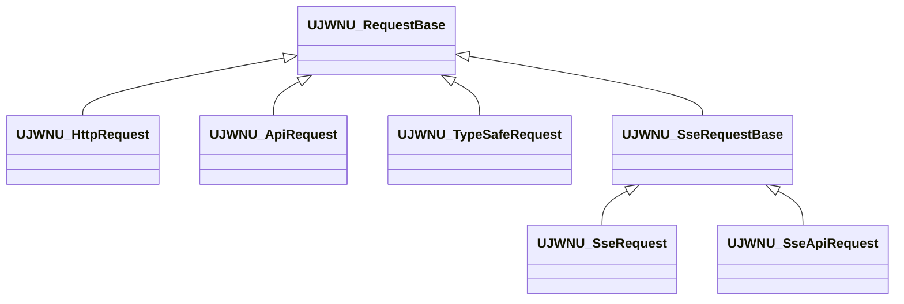

<!-- Copyright (c) 2026 Prayslaks. All rights reserved. Unauthorized copying, modification, or distribution of this file, via any medium is strictly prohibited. Proprietary and confidential. -->

# HTTP·API·OpenAI Live·TypeSafe 요청 사용 규약

> 부분 갱신 일자: 2026-09-26 — 즉시 실행 Call API를 정식 편의 노드로 복원. 응답 콜백을 입력받아 즉시 시작하며 선택적 제어 반환값은 API Request다.

> 부분 갱신 일자: 2026-09-26 — HTTP·SSE 즉시 실행 노드를 제거하고 SSE/SSE API 요청 객체 추가. Job·Job Handle은 내부 전송용으로 제한.

> 부분 갱신 일자: 2026-09-26 — 직접 URL을 사용하는 Create HTTP Request와 바인딩·Start·Cancel·IsActive 흐름 추가.

> 부분 갱신 일자: 2026-09-26 — Deprecated 호환 함수 10개와 삭제된 Evaluate의 핀 리다이렉트를 제거. 이전 함수 노드는 현재 생성·바인딩·Start 규약으로 교체한다.

> 부분 갱신 일자: 2026-09-26 — OpenAI·TypeSafe의 직접 API 키 입력을 C++ ApiKey, BP API Key로 통일하고 기존 Credential 핀 호환성을 추가.

> 부분 갱신 일자: 2026-09-26 — 생성 노드와 Start·Cancel·IsActive 명명, 일반 API의 바인딩 가능한 요청 객체, 기존 BP 전환 절차를 추가.

> 부분 갱신 일자: 2026-09-26 — Send HTTP Request 즉시 실행 복원. 콜백과 선택적 HTTP Request 반환값, API Key 핀을 제공한다.

> 부분 갱신 일자: 2026-09-26 — Call SSE API를 콜백 입력형 즉시 실행 함수로 복원. 반환값은 SSE API Request다.

> 부분 갱신 일자: 2026-09-26 — RequestBase 공통 부모·상태·OnFinished 및 TypeSafe 즉시 실행 노드 추가.

## 공통 Request 타입

HTTP·API·TypeSafe와 SSE 요청은 코어 모듈의 `UJWNU_RequestBase`를 상속한다. SSE의 직접 URL/서비스 타입은 기존 `UJWNU_SseRequestBase` 아래에 유지한다. OpenAI Live 세션과 WebSocket 연결은 별도 수명 모델을 사용한다.

| 공통 노드·이벤트 | 계약 |
| --- | --- |
| Cancel | 활성 요청만 취소. 생성 상태·종료 후 호출은 아무 동작도 하지 않음 |
| IsActive | 실행·재시도·인증 갱신·예약된 오류 전달을 기다리는 동안 true |
| GetState | Created / Active / Succeeded / Failed / Cancelled |
| OnFinished(Request, State) | 타입별 성공·실패 이벤트가 끝난 뒤 한 번 발생. 취소도 포함 |

종료 상태와 타입별 결과는 모든 종료 콜백 전에 저장한다. 이벤트에서 다시 Cancel하거나 종료 요청에 Start해도 상태나 종료 알림을 반복하지 않는다. OnFinished는 Native → BP 순서이며 콜백 동안 요청을 GC로부터 보호한다.

Blueprint 매크로·배열의 입력 타입을 **JWNU Request Base Object Reference**로 지정하면 요청 종류에 관계없이 Cancel·IsActive·GetState를 사용할 수 있다. 공통 종료 이벤트의 Request 핀으로 어느 요청이 끝났는지 구분한다. 결과 해석은 구체 타입의 OnCompleted·OnFailed·GetResult·GetError를 사용하고, 생성·Start의 입력도 각 타입에 유지한다.

이미 끝난 즉시 실행 요청은 OnFinished를 다시 발생시키지 않는다. 나중에 요청을 받는 그래프는 먼저 GetState를 확인한다. Created이면 아직 시작 전이고, Active이면 종료 이벤트를 바인딩한다. 나머지 상태면 저장된 결과로 바로 처리한다. 게임 스레드에서 확인·바인딩 사이에 Delay 같은 프레임 지연을 넣지 않는다.

공통 부모는 상태와 종료 통지를 소유한다. 내부 HTTP Job·Job Handle과 각 서브시스템의 활성 요청 보관·Pump는 그대로 유지한다. 새 파생 요청은 Created에서만 시작하고, 전송 전에 ActivateRequest, 결과 저장 후 SetFinishedState, 타입별 이벤트 이후 BroadcastFinished를 호출한다. CancelRequest를 구현하며 public Cancel·IsActive는 상속한다.

기존 구체 요청 변수는 그대로 사용할 수 있다. 공통화할 변수·매크로만 부모 타입으로 변경한다. 부모로 이동한 Cancel·IsActive 호출 노드는 에디터 재시작 후 Refresh/Compile하고, 저장된 에셋은 별도 확인한다. 이번 작업은 BP 에셋을 자동 재작성하지 않는다.

## 공통 순서

요청 객체 방식은 **생성 → 변수 저장 → 성공·실패 이벤트 바인딩 → Start**를 사용한다. 생성은 전송하지 않는다. 핸들은 일회용이다. 다시 실행할 때는 새 요청·세션을 만든다. 일반 API는 즉시 실행 **Call API**, 직접 HTTP는 **Send HTTP Request** 방식도 사용할 수 있다. 공개 함수와 이벤트는 게임 스레드에서 사용한다.

| 역할 | 직접 HTTP | 일반 API | OpenAI Live 세션 | TypeSafe Jev |
| --- | --- | --- | --- | --- |
| 생성 노드 | Create HTTP Request | Create API Request | Create OpenAI Live Session | Create TypeSafe Request |
| 객체 | `UJWNU_HttpRequest` | `UJWNU_ApiRequest` | `UJWNU_OpenAILiveSession` | `UJWNU_TypeSafeRequest` |
| 실행 | Start | Start | Start / Start From Environment | Start / Start From Environment |
| 활성 상태 | IsActive | IsActive | IsActive | IsActive |
| 성공 결과 | OnCompleted | OnCompleted | OnReady 이후 OnTranscript·OnAudio 등 | OnCompleted |
| 실패·오류 | OnFailed | OnFailed | OnError (`bFatal` 확인) | OnFailed |
| 즉시 중단 | Cancel → OnFailed(Cancelled) | Cancel → OnFailed(Cancelled) | Cancel → OnClosed | Cancel → OnFailed(Cancelled) |
| 정상 세션 종료 | 해당 없음 | 해당 없음 | Close → OnClosed | 해당 없음 |

생성 노드는 대상을 이름에 포함한다. 생성된 객체의 공통 함수 이름은 짧게 유지한다. Live의 연결 준비·지속 데이터·정상 종료 이벤트는 단건 요청의 완료 이벤트와 별도로 유지한다. Live `Cancel`은 기존 즉시 중단 동작이며 최종 사용량을 받지 못할 수 있다. `Close`는 서버의 종료 응답을 기다린다.

OpenAI 세션·컴포넌트와 TypeSafe의 직접 키 입력은 **API Key**로 표시하며 C++ 인자 이름은 `ApiKey`다. 기존 TypeSafe Start의 `Credential` 핀은 PropertyRedirect로 연결선과 직접 입력값을 새 핀에 보존한다. 에디터 재시작 후 기존 노드를 Refresh/Compile한다. 환경변수 이름은 공급자별 `OPENAI_API_KEY`·`TYPESAFE_API_KEY`다. 일반 API의 JWT AccessToken·RefreshToken은 토큰 종류를 나타내는 이름을 사용한다.

Create가 null이면 World·GameInstance가 유효한지 확인한다. Start 전에는 호출자가 BP 변수·C++ UPROPERTY 참조로 객체를 보관한다. Start 이후 활성 요청은 서브시스템이 GC로부터 보호하며, 소유 월드·GameInstance 종료 시 취소한다. 결과를 계속 사용하려면 요청 또는 결과를 보관한다.

**Start가 반환되기 전에 오류 이벤트가 발생할 수 있으므로 반드시 먼저 바인딩한다.** TypeSafe는 결과 전달을 다음 Pump까지 미루지만 그 지연에 의존하는 그래프를 만들지 않는다. `Start=false`는 새 실행을 접수하지 못했다는 뜻이다. 이미 사용한 핸들로 Start를 반복해도 새 결과 이벤트가 발생하지 않는다. TypeSafe의 입력 검증 실패는 false를 반환하면서 OnFailed를 다음 Pump에 예약할 수 있다.

## 일반 API

### 즉시 실행 — Call API

요청 객체를 직접 생성·바인딩하고 싶지 않으면 **Call API**에 ServiceType·Method·Endpoint·ContentBody·QueryParams·RequiresAuth와 응답 콜백을 연결한다. 노드를 실행하면 내부에서 콜백을 연결한 뒤 바로 전송한다. QueryParams와 재시도 콜백은 미연결 상태로 둘 수 있다.

- `InOnHttpResponse(StatusCode, ResponseBody)`는 성공·실패 모두 전달한다. 기존 상태 열거형과 정규화된 응답 본문을 사용한다.
- 선택적 `InOnHttpRequestJobRetry(AttemptNumber)`는 다음 시도 번호를 전달한다.
- 반환값 `UJWNU_ApiRequest`는 Cancel·IsActive·결과 조회가 필요할 때만 저장한다. 이미 시작된 요청이므로 Start를 다시 호출하지 않는다. 반환값을 저장하지 않아도 활성 요청은 서브시스템이 보관한다.
- 잘못된 월드는 nullptr와 START_FAILED 응답 콜백을 반환한다. Host·토큰 누락도 응답 콜백으로 전달하며, 생성된 요청은 오류 조회용으로 반환한다. 이런 오류 콜백은 Call API가 반환되기 전에 실행될 수 있다.
- 취소는 상태 None과 code=CANCELLED 본문으로 응답 콜백에 한 번 전달한다. 이전의 Job Handle 타입은 공개하지 않는다.

Call API는 Deprecated 함수가 아니다. 기존 BP의 입력 핀 이름은 같지만 옛 반환 변수 타입은 API Request로 교체해야 한다.

### 요청 객체 — Create API Request

`Create API Request`의 반환값을 변수에 저장하고 `OnCompleted`, `OnFailed`, 필요하면 `OnRetry`를 바인딩한다. `Start`에 ServiceType·Method·Endpoint·ContentBody·QueryParams·RequiresAuth를 전달한다.

- 기존 `CallApi_NoTemplate` 경로를 사용하므로 HostProvider, IdentityProvider, JWT 갱신, HTTP 재시도 설정을 공유한다.
- `OnCompleted`의 `FJWNU_ApiResult`는 기존 HTTP 상태 코드 열거형과 ResponseBody를 제공한다. 업무 결과가 `success=false`인지 여부는 응답 구조체 변환 후 호출자가 판단한다.
- `OnFailed`는 `FJWNU_ApiError`를 전달한다. Code는 RequestFailed 또는 Cancelled이며 Response에 기존 계층의 상태·오류 JSON이 들어간다. 기존 Call API와 같이 오류 본문은 정규화될 수 있다.
- 성공 상태는 OK·Created·Accepted·NoContent이며 그 외 2XX는 OtherSuccess다. 기존 열거형 값은 유지하고 OtherSuccess를 끝에 추가했다. 그 외 미등록 상태는 UnknownError로 전달된다.
- 재시도 때 `OnRetry(AttemptNumber)`가 발생한다. JWT 갱신 대기 중에도 IsActive가 true다. Cancel과 늦게 도착한 응답이 겹쳐도 종료 이벤트는 한 번만 발생한다.

## 직접 HTTP

`Create HTTP Request`의 반환값을 변수에 저장하고 `OnCompleted`·`OnFailed`·필요 시 `OnRetry`를 바인딩한 뒤 `Start`한다. `Start` 입력은 Method·URL·ContentBody·QueryParams·API Key다. QueryParams는 `AutoCreateRefTerm`이 적용되어 미연결 시 빈 맵을 사용하고, API Key는 비워도 된다.

- URL에는 `https://example.com/path`처럼 전체 주소를 전달한다. HostProvider·ServiceType·JWT 자동 갱신을 사용하지 않는다.
- 기존 HTTP 전송처럼 `Content-Type: application/json`을 사용한다. API Key가 있으면 `Authorization: Bearer <값>`을 추가한다. 별도 헤더·바이너리 업로드 입력은 제공하지 않는다.
- HTTP 2xx는 `OnCompleted(FJWNU_HttpResult)`, 그 외 응답·전송 실패·입력 오류·취소는 `OnFailed(FJWNU_HttpError)`다. 상태 코드는 원래 정수이며 HTTP 오류 본문도 정규화하지 않는다. 입력 오류는 Error.Message에 들어간다. 하위 전송 계층의 타임아웃 진단은 기존 동작을 따른다.
- `UJWNU_GIS_HttpClientHelper`의 기본 재시도·타임아웃 설정을 공유한다. 활성 요청은 이 서브시스템이 보관하고 월드·GameInstance 종료 시 취소한다. 취소 결과는 한 번만 전달한다.

### 즉시 실행 — Send HTTP Request

**Send HTTP Request**에 Method·URL·API Key·ContentBody·QueryParams와 응답 콜백을 전달하면 즉시 전송한다. Create·Bind·Start를 따로 호출할 필요가 없다. QueryParams와 재시도 콜백은 미연결 상태로 둘 수 있다.

- 응답 콜백은 기존 `StatusCode` 열거형과 원문 `ResponseBody`를 전달한다. HTTP 오류 본문도 그대로 전달하며, 정확한 정수 상태가 필요하면 반환 요청의 GetResult/GetError를 사용한다.
- 반환 `UJWNU_HttpRequest`는 선택적 Cancel·IsActive·결과 조회용이다. 활성 요청은 서브시스템이 보관하며 Start를 다시 호출하지 않는다.
- 잘못된 월드는 nullptr와 None/START_FAILED 콜백을 반환한다. 입력 오류도 START_FAILED, 취소는 CANCELLED JSON으로 한 번 전달한다. 상세 입력 오류는 반환 요청의 GetError.Message로 확인한다. 즉시 오류 콜백은 함수가 반환되기 전에 실행될 수 있다.
- 인증 입력은 C++ `ApiKey`, BP **API Key**다. 기존 `InAuthToken` 핀은 PropertyRedirect로 새 핀에 연결한다. 옛 반환 변수 타입은 HTTP Request로 교체하고 에디터에서 노드를 Refresh/Compile한다.

Send HTTP Request는 Deprecated 함수가 아니며 요청 객체 방식과 함께 사용할 수 있다.

## SSE

| 용도 | 생성 노드 | Start 주소·인증 입력 |
| --- | --- | --- |
| 직접 URL | Create SSE Request | URL·API Key |
| 서비스 Host·JWT | Create SSE API Request | ServiceType·Endpoint·RequiresAuth |

두 요청 모두 생성 → 변수 저장 → OnOpened·OnEvent·OnCompleted·OnFailed 바인딩 → Start 순서다. Start의 QueryParams·Options는 미연결 시 기본값이다. `Cancel`·`IsActive`·`GetResult`·`GetError`를 제공한다. 취소는 OnFailed의 Error=Cancelled로 전달한다. 일반 스트림 자동 재접속은 하지 않으며, 서비스 경로는 개방 전 401에 한해 JWT를 갱신하고 한 번 다시 시작한다. [SSE 가이드](SSE.md).

`UJWNU_HttpRequestJob`·`UJWNU_HttpRequestJobHandle`은 전송 계층의 C++ 내부 타입이다. BP 변수 타입·제어 노드로 노출하지 않는다. Job Handle은 API·SSE의 인증 갱신 중 Job 교체를 추적할 때만 내부에서 사용한다. 사용자 BP는 Request를 보관한다.

**Call SSE API**는 콜백 입력 후 즉시 실행하는 방식이다. QueryParams·Options·콜백 핀은 미연결 기본값을 지원한다. 정상 종료는 OnCompleted, 오류는 OnError, 취소는 OnCancelled로 전달한다. 반환 SSE API Request는 선택적 취소·조회용이며 Start를 다시 호출하지 않는다. 잘못된 월드는 nullptr와 OnError(InvalidRequest)를 전달한다. 자세한 사용법은 [SSE 가이드](SSE.md)의 즉시 실행 절을 따른다.

## TypeSafe 즉시 실행

`Call TypeSafe API` 또는 `Call TypeSafe API From Environment`에 State·Questions·Options와 OnCompleted·OnFailed 콜백을 연결한다. 명시적 키 방식은 API Key를 입력한다. Options·콜백은 미연결 상태로 둘 수 있다. 내부에서 생성·콜백 바인딩·Start를 수행하고, 반환 TypeSafe Request는 선택적 취소·조회 또는 공통 RequestBase 변수 저장에 사용한다.

일반 입력 오류도 기존 Pump를 통해 한 번 전달한다. Start=false를 보고 편의 함수가 추가 오류를 만들지 않는다. 월드가 유효하지 않으면 nullptr와 OnFailed(Configuration)를 즉시 전달한다. 환경변수 방식의 공식 endpoint 제한을 유지하며 실제 전송은 기존 요청 스케줄을 따른다. [TypeSafe 가이드](TypeSafe.md).

## OpenAI Live 컴포넌트

`UJWNU_OpenAILiveComponent`는 에디터에 추가한 컴포넌트가 세션을 내부 생성한다. 컴포넌트 이벤트 바인딩 → Start 순서이며, 함수 이름은 Start·Start From Environment·Close·Cancel로 통일한다. 다음 Start 때 새 세션을 생성한다.

컴포넌트가 상속한 `IsActive`는 Unreal의 **컴포넌트 활성화 상태**다. 네트워크 상태는 `GetSession`의 유효성을 확인한 뒤 반환된 세션의 `IsActive`로 조회한다. 기존 엔진 활성화 상태의 의미는 바꾸지 않는다.

## 기존 BP 전환

개발 중인 API이므로 Deprecated 호환 함수는 모두 제거했다. 이전 노드를 참조하는 BP는 아래 현재 노드로 교체해야 한다. 함수 자동 리다이렉트는 제공하지 않는다.

| 기존 노드 | 전환 |
| --- | --- |
| Send HTTP Request | 즉시 실행 사용 가능. 반환 변수는 HTTP Request로 교체. API Key 핀 사용 |
| Send SSE Request | Create SSE Request → 이벤트 바인딩 → Start |
| Call SSE API | 즉시 실행 사용 가능. 반환 변수는 SSE API Request로 교체. 기존 콜백 핀 유지 |
| Call API | 즉시 실행 방식으로 사용 가능. 반환 변수는 API Request로 교체. 요청 객체 방식을 원하면 Create API Request → Bind → Start 사용 |
| TypeSafe Create Request | Create TypeSafe Request |
| TypeSafe Evaluate / Evaluate From Environment | Create TypeSafe Request → 이벤트 바인딩 → Start / Start From Environment |
| Create Live Session | Create OpenAI Live Session |
| Live Abort | Cancel |
| Live 컴포넌트 Start Live / Start Live From Environment / Stop Live | Start / Start From Environment / Close |
| HTTP Job Handle의 Cancel / IsActive / IsCancelled | Request의 Cancel / IsActive / GetError로 교체. 취소 여부는 오류 코드로 확인 |

Call API의 옛 반환 타입은 `UJWNU_HttpRequestJobHandle`이고 현재 반환 타입은 `UJWNU_ApiRequest`다. 새 변수 타입을 사용하고 Cancel·상태 조회도 새 객체로 연결한다. 기존 에셋은 자동으로 재작성하지 않는다. C++에서도 CallApi 편의 함수와 요청 객체 방식 중 선택할 수 있다.

## 검증·유지보수

`run_api_tests.py --engine <UE-root> --project <uproject>`는 격리된 로컬 서버와 `JWNetworkUtility.API.Nodes`·`FastAPI`·`HTTP`·`Immediate`·`HTTPImmediate`·`CommonRequest` 6종을 실행한다. 현재 노드 노출과 삭제된 함수의 부재, 실제 BP 결과 전달, 성공·HTTP 실패·동기 설정 실패·취소·GC·월드·GameInstance 종료를 검사한다. 외부 API나 키를 사용하지 않는다.

일반 API의 공개 계약은 [JWNU_ApiRequest.h](../Source/JWNetworkUtility/Public/JWNU_ApiRequest.h), 수명 관리는 [ApiClientService_Requests.cpp](../Source/JWNetworkUtility/Private/JWNU_GIS_ApiClientService_Requests.cpp)다. 상세 공급자 동작은 [OpenAI Live](OpenAILive.md), [TypeSafe](TypeSafe.md)를 따른다. 공용 HTTP·JWT 계층을 바꿀 때는 API 외에 SSE·Live·TypeSafe 회귀 테스트도 실행한다.

2026-09-26 검증: UE 5.7 Win64 Development Game·Editor 빌드 성공. `Saved/Automation`의 `JWNUApi-20260926-125534`(노드 검사·9개 요청 시나리오), `JWNUTypeSafe-20260926-125238`, `JWNUOpenAILive-20260926-125313`, `JWNUSse-20260926-125608`에서 총 테스트 7종 성공·실패 0을 확인했다. API·SSE는 마지막 GameInstance 종료 정리 변경까지 반영한 빌드로 재검증했다. 실제 외부 서비스·키·오디오 장치는 사용하지 않았다.

2026-09-26 API Key 명칭 검증: Editor 빌드 성공. `JWNUTypeSafe-20260926-131738`에서 기존 Start·Evaluate Credential 핀의 연결선·직접 입력값 보존과 TypeSafe 테스트 2종을 확인했고, `JWNUOpenAILive-20260926-131815`의 Live 테스트도 성공했다. 실패 0이며 실제 API 키·외부 서비스를 사용하지 않았다.

2026-09-26 호환 함수 제거 검증: UE 5.7 Win64 Development Editor 빌드 성공. `JWNUApi-20260926-134920`(2), `JWNUTypeSafe-20260926-135022`(2), `JWNUOpenAILive-20260926-135108`(1), `JWNUSse-20260926-135143`(2)의 총 7개 테스트가 성공했다. 삭제 함수의 부재, 현재 BP 호출·Options 미연결 기본값, SSE 핸들 상태 조회를 확인했다. 외부 API는 호출하지 않았다.

2026-09-26 Create HTTP Request 검증: UE 5.7 Win64 Development Editor 빌드 성공. JWNUApi-20260926-140501에서 API·HTTP·노드 테스트 3종이 모두 성공했다. HTTP 10개 시나리오에서 BP Start의 QueryParams 미연결, 원문 성공/오류 본문과 정수 상태, POST 본문·Bearer 전달, 재시도, 중복 시작 거부, 취소, GC 및 월드·GameInstance 종료를 확인했다. 실제 외부 API는 호출하지 않았다.

2026-09-26 공개 요청 경계 정리 검증: UE 5.7 Editor 빌드 성공. `JWNUSse-20260926-142304`의 Parser·FastAPI(21개 시나리오)와 `JWNUApi-20260926-142436`의 API·HTTP·노드 노출 테스트가 모두 성공했다. Job·Job Handle의 BP 타입 노출 제거와 이전 HTTP 함수 부재, SSE 기본 인자 BP 실행·JWT 갱신·취소·GC·GameInstance 종료를 검증했다.

기존 예제 에셋 전환: 저장된 BP 바이너리는 자동 변환하지 않았다. 플러그인의 `BML_JWNU_ApiClientService`, `BP_JWNU_SendRequestExample`, `BP_JWNU_JobHandleExample`, `WBP_JWNU_SSESample` 등에서 옛 이름이 검색되므로, 에디터에서 위 전환 표에 맞춰 사용 노드·변수 타입을 교체하고 Compile한다. 다른 예제의 문자열은 매크로 참조로 포함될 수 있으므로 각 그래프의 실제 사용 여부를 확인한다.

2026-09-26 즉시 실행 복원 검증: UE 5.7 Editor 빌드 성공. `JWNUApi-20260926-143412`의 Nodes·FastAPI·HTTP·Immediate 4종 모두 성공했다. Immediate는 기존 API와 동일한 9개 시나리오로 BP 응답 전달·HTTP 실패·Host/토큰 즉시 오류·취소·GC·월드/GameInstance 종료를 확인했고, Nodes에서 잘못된 월드의 START_FAILED 콜백도 검증했다.
2026-09-26 Send HTTP Request 복원 검증: UE 5.7 Editor 빌드 성공. `JWNUApi-20260926-144416`의 Nodes·FastAPI·HTTP·Immediate·HTTPImmediate 5종 모두 성공했다. HTTPImmediate의 10개 시나리오에서 BP 응답 전달·원문 오류 본문·206 상태 매핑·POST/Bearer 전달·재시도·입력 오류·취소·GC·월드/GameInstance 종료를 확인했고, Nodes에서 잘못된 월드의 START_FAILED 콜백을 확인했다. 실제 외부 API를 호출하지 않았다.

2026-09-26 Call SSE API 복원 검증: UE 5.7 Editor 빌드 성공. `JWNUSse-20260926-152330`의 Parser·FastAPI·Immediate 3종이 모두 성공했다. 요청 객체와 즉시 실행 각각 21개 시나리오로 BP JSON 변환·POST·추가 헤더·오류 본문·시간 제한·취소·GC·월드/GameInstance 종료·JWT 갱신 및 갱신 중 취소를 확인했다. 잘못된 월드의 nullptr/OnError(InvalidRequest)와 노드 노출·Options 기본값 메타데이터도 확인했다. 외부 서비스나 실제 API 키를 사용하지 않았다.

2026-09-26 공통 부모·TypeSafe 즉시 실행 검증: UE 5.7 Win64 Development Editor 빌드 성공. `JWNUApi-20260926-160633`(6), `JWNUTypeSafe-20260926-160437`(3), `JWNUSse-20260926-160800`(3)의 총 12개 자동화 테스트 성공·실패 0. CommonRequest는 부모 타입만 받는 실제 BP 그래프에서 HTTP·API·SSE·SSE API·TypeSafe 취소와 공통 종료 이벤트를 검증했다. TypeSafe는 두 호출 방식 각각 25개 시나리오 및 새 BP 즉시 실행 노드의 Options·콜백 미연결 컴파일/실행, 지연 오류 단일 통지·공통 이벤트 순서를 검증했다. HTTP·API와 SSE의 기존 즉시 실행·요청 객체·GC·인증·종료 테스트도 통과했다. 외부 서비스와 실제 API 키는 사용하지 않았다. 저장된 사용자 BP 에셋은 자동 변경하지 않았다.