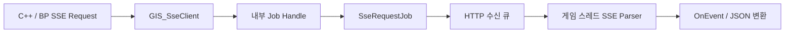

<!-- Copyright (c) 2026 Prayslaks. SPDX-License-Identifier: MIT -->

# SSE HTTP 클라이언트

> 부분 갱신 일자: 2026-09-26 — SSE를 Create → Bind → Start로 통일. 즉시 실행 BFL 제거, Job Handle 내부화, 취소를 OnFailed(Cancelled)로 전달.

> 부분 갱신 일자: 2026-09-24 — uv 환경으로 수동 실행·자동 테스트 명령 통일.

> 부분 갱신 일자: 2026-09-24 — TestServer 이동과 Uvicorn 실행 경로 반영.

> 부분 갱신 일자: 2026-09-23 — HTTP 스트림, C++·BP 이벤트 API, JWT 갱신 연결 및 FastAPI 통합 테스트 추가.

> 부분 갱신 일자: 2026-09-26 — Call SSE API 즉시 실행 노드 복원. 기존 콜백 핀을 유지하고 반환 타입을 SSE API Request로 제공한다.

> 부분 갱신 일자: 2026-09-26 — SSE RequestBase가 공통 JWNU RequestBase를 상속해 GetState·OnFinished를 제공한다.

## 목적과 범위

HTTP 응답 하나의 본문을 점진적으로 받아 완성된 SSE 이벤트마다 게임 스레드에서 콜백을 호출한다. GET과 POST를 지원하며 JSON 요청 본문, Bearer 토큰, 쿼리, 추가 헤더를 사용할 수 있다. 특정 LLM Provider의 JSON 형식이나 완료 마커를 해석하지 않는다. WebSocket과 WebRTC는 이 기능에 포함하지 않는다.

## 빠른 시작 — Blueprint

1. GameInstance가 있는 월드에서 **Create SSE Request**를 호출하고 반환값을 변수에 저장한다. 생성은 전송하지 않는다.
2. 요청의 `OnOpened`, `OnEvent`, `OnCompleted`, `OnFailed` 이벤트를 바인딩한다.
3. `OnEvent`의 `FJWNU_SseEvent.Data`를 기존 `Convert Json String To Struct`로 변환한다. 테스트 데이터는 Index·Text·Echo·Header 필드를 사용한다.
4. `Start`에 Method=Get, URL=`http://127.0.0.1:5000/sse/events`를 지정한다. QueryParams·Options는 미연결 시 기본값이며 API Key는 비워도 된다.
5. `OnCompleted`는 HTTP 정상 EOF, `OnFailed`는 HTTP·전송·인증 오류 및 취소다. 취소 시 Error는 `Cancelled`다.
6. 요청의 `Cancel`, `IsActive`, `GetResult`, `GetError`를 사용한다. 일회용이므로 재호출할 때 새 요청을 생성한다.

Host·JWT를 사용하려면 **Create SSE API Request**로 생성·바인딩한 뒤 `Start`에서 ServiceType·Endpoint·RequiresAuth를 지정한다. RequiresAuth=true이면 등록 JWT가 Options.Headers의 Authorization보다 우선한다. 직접 URL 요청은 선택적 **API Key**를 Bearer 값으로 전달한다.

### 즉시 실행 — Call SSE API

**Call SSE API**에 Method·Body·QueryParams·Options·ServiceType·Endpoint·RequiresAuth와 콜백을 연결하면 바로 시작한다. 별도의 Create·Bind·Start는 필요 없다. QueryParams·Options·각 콜백은 미연결 상태로 둘 수 있다.

- 기존 `OnOpened`, `OnEvent`, `OnCompleted`, `OnError`, `OnCancelled` 입력 핀을 유지한다. OnEvent.Data는 기존 JSON 변환 노드로 처리한다.
- 정상 EOF는 OnCompleted, 오류는 OnError, 취소는 OnCancelled 중 하나로 한 번 전달한다. 취소 시 OnError를 함께 호출하지 않는다.
- 반환 `UJWNU_SseApiRequest`는 선택적 Cancel·IsActive·GetResult·GetError용이다. Start를 다시 호출하지 않는다. 내부 요청이 Host·JWT 갱신과 GC·월드 종료 처리를 담당한다.
- 잘못된 월드는 nullptr를 반환하고 OnError(InvalidRequest)를 한 번 호출한다. Host 누락 같은 시작 오류는 함수 반환 전에 전달될 수 있다.
- 기존 Job Handle 반환 변수는 SSE API Request로 바꾸고 노드를 Refresh/Compile한다. 입력 핀은 유지하지만 기존 에셋을 자동 재작성하지는 않는다.

Call SSE API는 정식 편의 노드이며 요청 객체 방식도 계속 제공한다. 직접 URL의 옛 Send SSE Request는 Create SSE Request → Bind → Start를 사용한다. 요청 객체 방식에서는 OnError·OnCancelled 대신 OnFailed의 오류 코드를 분기한다.

## C++ 사용

요청 객체 진입점은 [JWNU_SseRequest.h](../Source/JWNetworkUtility/Public/JWNU_SseRequest.h), 즉시 실행은 [JWNU_BFL_SseClient.h](../Source/JWNetworkUtility/Public/JWNU_BFL_SseClient.h)의 CallSseApi다.

```cpp
UJWNU_SseRequest* Request = UJWNU_SseRequest::CreateSseRequest(this);
if (!Request) { return; }
// Start 전까지 UPROPERTY 참조로 보관한다.
Request->OnEventNative.AddWeakLambda(this, [this](const FJWNU_SseEvent& Event)
{
    // Event.Data를 필요한 USTRUCT로 변환한다.
});
Request->OnFailedNative.AddWeakLambda(this, [](const FJWNU_SseResponse& Error)
{
    // Error.Error, StatusCode, Headers, ErrorBody를 확인한다.
});
Request->Start(EJWNU_HttpMethod::Post, URL, JsonBody, {}, FJWNU_SseOptions(), ApiKey);
```

| 생성 → 바인딩 → 실행 | 주소·인증 |
| --- | --- |
| `CreateSseRequest` → Bind → `Start` | 전체 URL·API Key |
| `CreateSseApiRequest` → Bind → `Start` | ServiceType·Endpoint·등록 JWT |

기존 즉시 실행 템플릿 함수도 제거했다. C++에서는 OnEventNative에서 `FJsonObjectConverter::JsonObjectStringToUStruct`로 Data를 변환하고 파싱 실패를 처리한다. 구조체에 Code·Message 필드는 필요 없다. `[DONE]`이나 일반 텍스트처럼 JSON이 아닌 이벤트는 먼저 분기한다. BP는 기존 wildcard JSON 변환 노드를 사용한다.

SSE 요청은 공통 `UJWNU_RequestBase` 타입의 변수·배열·매크로에 저장할 수 있다. Cancel·IsActive는 부모에서 제공하며, GetState는 성공 EOF·실패·취소를 구분한다. OnCompleted·OnFailed 전달 뒤 OnFinished(Request, State)가 한 번 발생한다. OnOpened·OnEvent는 스트리밍 전용으로 유지한다. [공통 요청 가이드](RequestLifecycle.md).

## 처리 구조와 소유권



- Job·Job Handle은 BP 변수 타입이나 제어 노드로 노출하지 않는다. Handle은 JWT 갱신으로 교체되는 Job을 내부에서 추적한다.
- 서브시스템이 활성 Request와 Handle을 보관한다. 월드·GameInstance 종료 시 Request를 취소한다. 콜백 중 GC·종료에도 처리 중인 Request·Handle·Job을 보호한다.
- Create는 전송하지 않는다. 잘못된 월드에서는 nullptr다. Start 이후 실제 연결은 다음 Tick에 시작하며 Options·QueryParams에는 AutoCreateRefTerm을 적용한다.
- `OnOpened` 뒤 여러 `OnEvent`, 마지막에 OnCompleted 또는 OnFailed를 한 번 전달한다. 개방 전 실패에는 OnOpened가 없다. 취소하면 큐에 남은 이벤트를 버린다.
- OnCompleted는 HTTP 정상 EOF다. Provider의 답변 완료 여부는 이벤트를 받은 측에서 해석한다. EOF의 미완성 프레임은 버린다.
- 스트림과 일반 HTTP는 요청 구성 코드를 공유한다. 일반 HTTP의 기존 오류 정규화·재시도 계약은 유지한다.

## 파싱 계약

UTF-8 바이트를 줄 경계까지 보관해 분할된 한글·이모지를 보존한다. LF/CRLF/CR, 스트림 처음의 BOM, 주석, 알 수 없는 필드, 다중 data 줄, 빈 data, 빈 줄 구분을 처리한다. event가 비면 `message`, id는 마지막 유효 값을 유지하고 빈 id로 초기화한다. NUL이 있는 id와 유효하지 않은 retry는 무시한다.

`RetryMilliseconds`는 서버의 재연결 힌트이며 자동 재연결 명령이 아니다. 해당 시점의 값을 데이터 이벤트에 함께 전달한다. **SSE 전송 자체는 자동 재시도하지 않는다.** POST 중복 실행과 이미 전달한 이벤트의 중복을 방지하기 위해 재연결 및 `Last-Event-ID` 사용은 호출 측 정책으로 둔다. 요청할 때 `Options.Headers`로 Last-Event-ID를 전달할 수 있다.

JWT 서비스 경로만 개방 전 401에 대해 기존 단일 갱신 큐를 사용하고 새 Job으로 한 번 재요청한다. 동일 Request와 내부 Handle을 유지하며 갱신 대기 중 취소도 가능하다. 429는 상태 코드와 소문자 키의 `retry-after` 헤더를 OnFailed로 전달한다.

## 옵션과 오류

| 옵션 | 기본값 | 의미 |
| --- | --- | --- |
| `Headers` | 빈 맵 | 추가 HTTP 요청 헤더 |
| `OpenTimeoutSeconds` | 30초 | 요청 시작부터 SSE 개방까지 |
| `IdleTimeoutSeconds` | 30초 | 개방 이후 수신이 없는 시간; heartbeat도 수신으로 취급 |
| `TotalTimeoutSeconds` | 0 | 한 HTTP 시도의 전체 수명; 0은 무제한 |
| `MaxEventBytes` | 1 MiB | 한 줄과 누적 data 크기의 상한 |
| `MaxQueuedBytes` | 4 MiB | 게임 스레드 처리 전 수신 큐 크기 상한 |
| `MaxErrorBodyBytes` | 64 KiB | HTTP 오류 원문 보관 상한 |

시간 제한은 실제 경과 시간을 사용하며 0으로 해제한다. JWT 갱신 후 새 HTTP 시도는 시간 제한을 새로 시작한다. 비2xx는 HTTP 오류이며 본문과 헤더를 보존한다. 2xx라도 Content-Type이 text/event-stream이 아니면 InvalidContentType이다. 전송 중단은 Network, 상한 초과는 BufferLimit로 종료한다. 오류 본문이 잘렸으면 bErrorBodyTruncated가 true다.

## FastAPI 종단 테스트

테스트 서버는 Content 밖의 [TestServer/main.py](../TestServer/main.py)에 있는 FastAPI ASGI 앱이며 Uvicorn으로 실행한다. `StreamingResponse`로 바이트를 점진 전송한다. GET·POST `/sse/events`는 무인증, `/api/sse/events`는 기존 JWT 미들웨어를 사용한다. `count`, `delay`, `split`, `mode`, `status`로 정상·분할·지연·중단·오류를 재현한다.

데모 UMG에서 수동 호출할 때는 프로젝트 루트에서 다음 명령을 사용한다.

```powershell
uv sync --locked --project Plugins/JWNetworkUtility/TestServer
uv run --locked --project Plugins/JWNetworkUtility/TestServer uvicorn main:app --app-dir Plugins/JWNetworkUtility/TestServer --host 127.0.0.1 --port 5000
```

자동 테스트는 별도 서버 프로세스를 직접 시작하므로 수동 서버 실행이 필요 없다.

```powershell
uv run --locked --project Plugins/JWNetworkUtility/TestServer python Plugins/JWNetworkUtility/TestServer/run_sse_tests.py `
  --engine "C:/Program Files/Epic Games/UE_5.7" `
  --project ProjectZK.uproject
```

엔진 루트는 설치 위치에 맞게 바꾼다. 먼저 호스트 Editor 타깃을 빌드한다. 실행기는 127.0.0.1:18573에 전용 서버를 시작하고 숨김 UnrealEditor-Cmd를 실행한 뒤 서버를 정리한다. 결과는 호스트 `Saved/Automation/JWNUSse-<실행시각>/`의 index.json, Unreal.log, fastapi.log에 남는다. 포트가 사용 중이면 `--port`로 변경한다.

서버는 `main.py` 옆 `.env`를 읽고 같은 이름의 환경변수를 우선한다. 예제는 [.env.example](../TestServer/.env.example)을 따른다. 기존 `python main.py --access-token-expire/--refresh-token-expire` 옵션은 `ACCESS_TOKEN_EXPIRE_SECONDS`와 `REFRESH_TOKEN_EXPIRE_SECONDS` 설정으로 대체했다(기본 60초/360초). 테스트 세션은 메모리에 저장되므로 worker 하나를 사용한다.

- `JWNetworkUtility.SSE.Parser`: 모든 두 조각 경계와 바이트 단위 분할, SSE 필드·EOF·상한을 검증한다.
- `JWNetworkUtility.SSE.FastAPI`: `-JWNUSseIntegration`이 있을 때 실제 서버로 연결한다. 서버가 없으면 실패하며, 플래그가 없으면 실행을 생략했다고 로그에 남긴다.
- 통합 테스트는 임시 BP를 메모리에 생성·컴파일해 Event.Data → 기존 JSON wildcard 변환 → 테스트 USTRUCT 소비를 실행한다. 프로젝트 .uasset을 변경하지 않는다.
- 테스트 인증 발급 `/sse/test-session`은 `JWNU_SSE_TEST_FIXTURES=1`과 루프백 요청일 때만 활성화한다. 실행기가 이를 설정한다. 테스트는 기존 로컬 JWT 저장 파일을 백업하고 종료 후 복원한다.
- 서버의 yield 경계는 TCP 수신 경계를 보장하지 않으므로 정확한 경계 검증은 Parser 단위 테스트가 담당한다.

통합 테스트는 21개 시나리오로 직접/BP/서비스 요청·이벤트 구조체 변환·기본 옵션·GameInstance 종료, POST·추가 헤더, 429, MIME 오류, 수신 중·시작 전·월드 정리·인증 갱신 대기 중 취소, 연결/유휴/전체 시간 제한, 전송 중단, 미완성 EOF, 이벤트 JSON 오류, 이벤트/큐 상한, JWT 401 갱신을 확인한다. 수신 중 및 인증 갱신 중 GC도 강제 실행한다. 고의 연결 중단·큐 초과·잘못된 JSON에서 엔진 경고가 발생할 수 있으며 Automation의 성공(경고 있음)도 통과로 집계한다.

검증 대상 엔진은 ProjectZK의 **UE 5.7 / Win64**다. 플러그인 descriptor의 기존 5.6 표기는 변경하지 않았으며, SSE 경로의 다른 엔진 버전 및 플랫폼은 별도 검증이 필요하다.

### 검증 기록 — 2026-09-23

- `ProjectZKEditor Win64 Development`, `ProjectZK Win64 Development` 빌드 성공.
- `JWNetworkUtility.SSE.Parser`, `JWNetworkUtility.SSE.FastAPI` 모두 성공, 실패 0. 통합 테스트에는 고의 오류 주입 경고와 기존 INI 경로·초기 JWT 백업 파일 부재 경고가 기록됐다.
- 호스트 실행 리포트: `Saved/Automation/JWNUSse-20260923-231443/index.json`. 생성 리포트는 버전 관리 대상이 아니며 위 실행기로 재생성한다.

### 실행 경로 변경 검증 — 2026-09-24

- 이동한 `TestServer/run_sse_tests.py`가 `python -m uvicorn main:app --app-dir ...`로 서버를 시작한 뒤 두 Automation 테스트를 모두 통과했다(실패 0, 기존 고의 오류 주입 등에 따른 경고 포함).
- 호스트 실행 리포트: `Saved/Automation/JWNUSse-20260924-212436/index.json`.

### uv 환경 검증 — 2026-09-24

- uv 0.12.18, Python 3.13.5의 `TestServer/.venv`에서 위 `uv run --locked` 자동 테스트 명령 실행 성공. 두 Automation 테스트 통과, 실패 0, 고의 오류 주입 등의 경고 포함.
- 호스트 실행 리포트: `Saved/Automation/JWNUSse-20260924-212903/index.json`.

## 구현 위치

| 파일 | 책임 |
| --- | --- |
| [JWNU_SseTypes.h](../Source/JWNetworkUtility/Public/JWNU_SseTypes.h) | 이벤트·결과·옵션·델리게이트 |
| [JWNU_SseParser.cpp](../Source/JWNetworkUtility/Private/JWNU_SseParser.cpp) | 증분 SSE 파서 |
| [JWNU_SseRequestJob.cpp](../Source/JWNetworkUtility/Private/JWNU_SseRequestJob.cpp) | HTTP 스트림·큐·종료 |
| [JWNU_GIS_SseClient.cpp](../Source/JWNetworkUtility/Private/JWNU_GIS_SseClient.cpp) | 내부 전송·인증·GC·월드 수명 |
| [JWNU_SseRequest.h](../Source/JWNetworkUtility/Public/JWNU_SseRequest.h) | 공개 요청 객체·이벤트·Start·Cancel |
| [JWNU_SseIntegrationTest.cpp](../Source/JWNetworkUtilityTest/Private/JWNU_SseIntegrationTest.cpp) | 실제 HTTP와 BP 그래프 검증 |

외부 근거: [SSE 표준](https://html.spec.whatwg.org/multipage/server-sent-events.html), [FastAPI StreamingResponse](https://fastapi.tiangolo.com/advanced/custom-response/#streamingresponse).

2026-09-26 Call SSE API 복원 검증: UE 5.7 Editor 빌드 성공. `JWNUSse-20260926-152330`의 Parser·FastAPI·Immediate 3종이 모두 성공했다. 요청 객체와 즉시 실행 각각 21개 시나리오로 BP JSON 변환·POST·추가 헤더·오류 본문·시간 제한·취소·GC·월드/GameInstance 종료·JWT 갱신 및 갱신 중 취소를 확인했다. 잘못된 월드의 nullptr/OnError(InvalidRequest)와 노드 노출·Options 기본값 메타데이터도 확인했다. 외부 서비스나 실제 API 키를 사용하지 않았다.
