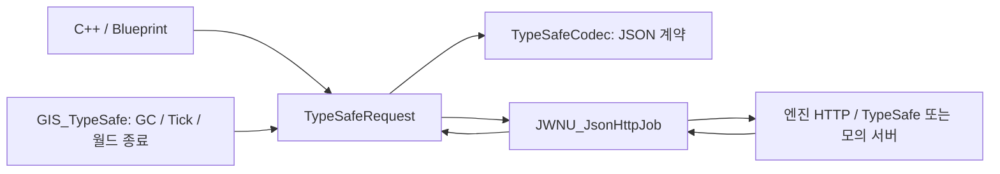

<!-- Copyright (c) 2026 Prayslaks. All rights reserved. Unauthorized copying, modification, or distribution of this file, via any medium is strictly prohibited. Proprietary and confidential. -->

# TypeSafe Jev — C++ / Blueprint

> 부분 갱신 일자: 2026-09-26 — Deprecated 호환 함수 10개와 삭제된 Evaluate의 핀 리다이렉트를 제거. 이전 함수 노드는 현재 생성·바인딩·Start 규약으로 교체한다.

> 부분 갱신 일자: 2026-09-26 — 직접 키 입력 Credential을 ApiKey(API Key)로 변경하고 기존 핀 연결·입력값 보존 Redirect를 추가.

> 부분 갱신 일자: 2026-09-26 — Start·Start From Environment의 Options 미연결 시 기본 구조체 참조를 자동 생성하도록 수정.

> 부분 갱신 일자: 2026-09-26 — 생성 이름을 Create TypeSafe Request로 명시하고 [공통 요청 규약](RequestLifecycle.md)에 맞춤. 옛 Create Request 호환 함수는 제거.

> 부분 갱신 일자: 2026-09-26 — 호출 순서를 Create TypeSafe Request → 이벤트 바인딩 → Start로 통일하고 Evaluate 계열은 제거.

> 부분 갱신 일자: 2026-09-26 — 생성 노드 입력을 Criteria로 통일하고 Noul의 true/false 설명 구조체·선택적 BP 입력과 핀 이름 Redirect를 추가.

> 부분 갱신 일자: 2026-09-26 — TypeSafe Runtime 모듈, 세 질문 타입, 유한 JSON HTTP Job과 로컬 자동 테스트 추가.

> 부분 갱신 일자: 2026-09-26 — RequestBase 상속과 Call TypeSafe API / From Environment 즉시 실행 지원.

## 목적과 범위

`JWNetworkUtilityTypeSafe`는 TypeSafe의 System One HTTP API를 호출해 Choice·Score·Noul 결과를 C++와 Blueprint 타입으로 제공한다. `POST https://api.typesafe.ai/v1/systemone`에 `model`, `state`, `questions`를 보내고 `answers`와 토큰 사용량을 읽는다. OpenAI·오디오 모듈에 의존하지 않는다. 게임 명령 실행·서버 RPC·음성 인식은 호출자가 담당한다.

계약 기준: [공식 API](https://docs.typesafe.ai/api), [질문 타입](https://docs.typesafe.ai/primitives), [모델과 언어 지원](https://docs.typesafe.ai/models), [재시도 정책](https://docs.typesafe.ai/sdk/python/api/retries). 확인일 2026-09-26. `jev-latest`는 이동하는 별칭이므로 검증된 판단을 유지해야 하면 `Model`을 버전 ID로 고정한다. 실제 응답한 버전은 `Result.Model`이다.

## BP 빠른 시작

1. 모듈을 빌드하고 에디터를 재시작한다. 별도 HTTP HostProvider나 JWT 설정은 필요 없다.
2. 에디터 프로세스에 `TYPESAFE_API_KEY` 환경변수를 제공한다. 환경변수를 변경했다면 에디터와 이를 실행한 부모 프로세스를 다시 시작한다.
3. `Make JWNU Type Safe State`의 `Format=Text`, `Value=편대 복귀`를 지정한다.
4. `Make Choice Question`에 `Id=action`, `Instructions=발화가 요청하는 명령을 선택하세요.`를 넣고, Criteria 맵에 `return=복귀`, `hold=대기`, `none=명령이 아니거나 불명확함`을 넣는다. 질문 ID는 응답 조회용이며 지침을 대신하지 않는다.
5. `Create TypeSafe Request`로 핸들을 만들고 Request 변수에 저장한다. 유효한 객체인지 확인한다. 이 단계에서는 전송하지 않는다.
6. 해당 Request의 `On Completed`, `On Failed`를 바인딩한다.
7. 같은 Request에 `Start From Environment`를 호출하면서 State·질문 배열을 전달한다. Options는 연결하지 않으면 구조체 기본값을 자동 사용한다. 값을 바꾸려면 `Make JWNU Type Safe Options`를 연결하거나 Options 핀을 분할한다. 명시적 API 키를 전달할 때는 대신 `Start`를 호출하며 Options 생략 방식은 같다.
8. `On Completed`의 Result를 Break하고 `Choices` 맵에서 `action`을 Find한다. `Choice`, `Confidence`, `Probabilities`를 읽는다. Score와 Noul도 `Scores`, `Nouls` 맵에서 질문 ID로 찾는다.
9. 취소 버튼에서는 Request의 `Cancel`을 호출한다. 취소도 `On Failed`의 `Code=Cancelled`로 한 번 전달된다.

호출 순서는 **`Create TypeSafe Request` → 변수 저장 → 성공·실패 이벤트 바인딩 → `Start` 또는 `Start From Environment` 한 번**이다. `Create TypeSafe Request`가 null을 반환하면 사용 가능한 World·GameInstance가 없는 경우다. Start 전에 프레임을 넘겨 보관할 때도 BP 변수 또는 C++ UPROPERTY 참조로 핸들을 유지한다. 활성 요청의 서브시스템 GC 보호는 Start에서 시작한다. 최초 전송·설정 오류 전달은 Start 이후 Pump에서 처리된다.

`Start`가 false를 반환하는 경우: 이미 사용한 핸들 또는 사용할 수 없는 월드는 예약되지 않는다. 처음 사용하는 유효한 월드에서 입력 검증에 실패하면 false를 반환하면서 실패 이벤트를 다음 Pump에 예약한다. 예약 여부는 `IsActive`로 구분할 수 있다. 결과를 보관해야 하면 Request 또는 반환된 Result를 BP 변수에 저장한다. 종료된 요청은 서브시스템의 GC 보호에서 제거된다.

### 즉시 실행과 공통 Request

`Call TypeSafe API`에 State·Questions·Options·API Key·OnCompleted·OnFailed를 전달하면 별도 Create·Bind·Start 없이 평가를 예약한다. `Call TypeSafe API From Environment`는 TYPESAFE_API_KEY를 사용한다. Options와 콜백 핀은 미연결 기본값을 지원한다. 성공 결과는 FJWNU_TypeSafeResult, 오류·취소는 FJWNU_TypeSafeError다.

반환값은 TypeSafe Request이며 Cancel·결과 조회가 필요할 때만 보관한다. RequestBase를 상속하므로 공통 BP 변수·배열·매크로에도 연결할 수 있다. 활성 요청은 기존 서브시스템이 보관한다. 반환 요청에 Start를 다시 호출하지 않는다.

잘못된 월드는 nullptr와 OnFailed(Configuration)를 즉시 전달한다. 그 외 입력 오류는 기존 Start처럼 다음 Pump에서 전달한다. 환경변수 함수는 공식 endpoint 제한을 그대로 적용한다. `Call`은 평가를 예약하는 즉시 실행 진입점이며 네트워크 완료를 기다리는 동기 함수가 아니다.

공통 GetState는 Created·Active·Succeeded·Failed·Cancelled를 반환한다. 입력 검증 실패도 콜백 전달 전에는 Active다. 타입별 결과 콜백 전에 최종 상태를 저장하고 콜백 이후 OnFinished(Request, State)를 한 번 전달한다. 이미 끝난 요청을 받은 그래프는 이벤트를 기다리지 말고 GetState를 확인한다. [공통 요청 가이드](RequestLifecycle.md).

### 기존 Evaluate 노드 전환

[Deprecated 2026-09-26] `Evaluate`·`Evaluate From Environment`는 제거했다. 기존 호출은 Create TypeSafe Request → 이벤트 바인딩 → Start / Start From Environment로 교체한다.

기존 Evaluate 노드를 `Create TypeSafe Request`로 교체하고 반환 핸들의 변수 저장·이벤트 바인딩 뒤에 `Start`를 배치한다. 기존 State·Questions·Options·API Key 연결은 Start로 옮긴다. `Evaluate From Environment`를 쓰던 그래프는 `Start From Environment`로 옮긴다. 반환 핸들에 대한 취소·결과 조회 연결은 그대로 재사용한다. C++도 같은 순서로 교체한다. 콜백 입력형 즉시 실행이 필요하면 새 Call TypeSafe API / From Environment를 사용한다.

## 데이터 계약

### 질문 생성 노드의 Criteria

| 노드 | Criteria 핀 타입 | JSON |
| --- | --- | --- |
| Make Choice Question | String → String Map | `"criteria": {"returns":"교환·반품", "billing":"결제 문제"}` |
| Make Score Question | String Array | `"criteria": ["기능 영향 없음", "우회 가능", "진행 불가"]` |
| Make Noul Question | JWNU Type Safe Noul Criteria 구조체 | `"criteria": {"true":"이전 문의를 명시함", "false":"이전 문의 정보가 없음"}` |

Noul은 `Make JWNU Type Safe Noul Criteria`를 연결하거나 Criteria 핀의 **Split Struct Pin**으로 `True Description`·`False Description`을 펼쳐 입력한다. 두 값 모두 설명 문자열이며 true/false 판단 결과를 입력하는 bool이 아니다. Criteria를 연결하지 않거나 설명을 모두 비우면 JSON에서 `criteria`가 생략된다. 한쪽만 입력하면 그 키만 전송한다. 이는 [공식 Noul 문서](https://docs.typesafe.ai/primitives/noul)의 선택적 설명 계약을 따른다.

기존 BP의 Score `Levels`·Choice `Options` 핀은 플러그인의 `CoreRedirects`로 `Criteria`에 연결된다. 빌드 후 에디터를 재시작하고 기존 노드를 Refresh/Compile한다. 기존 Question 구조체의 저장 필드 `ChoiceOptions`, `ScoreLevels`, `YesDescription`, `NoDescription`은 유지하므로 저장된 값도 유지된다. Noul helper가 새 Criteria 구조체를 기존 Yes/No 설명 필드에 매핑한다. C++의 `MakeNoulQuestion`에는 세 번째 인자로 Criteria를 전달하며, 생략할 때는 `{}`를 전달한다.

| 입력 | 의미와 검증 |
| --- | --- |
| State.Text | Value를 그대로 JSON 문자열로 인코딩한다. JSON처럼 생긴 텍스트도 파싱하지 않는다. |
| State.Json | Value를 JSON 문자열·객체·배열로 파싱해 state에 넣는다. 숫자·bool·null은 거부한다. |
| Questions | 비어 있지 않은 배열. ID는 비어 있지 않고 중복이 없어야 한다. |
| ChoiceOptions | 1~255개 ID/설명 맵. |
| ScoreLevels | 낮은 단계부터 2~10개 설명 배열. |
| Noul | Instructions와 선택적 YesDescription·NoDescription. |
| InstructionsJson | 비어 있지 않으면 Instructions 대신 JSON 문자열·객체·배열로 전송한다. |
| CriteriaJson | 비어 있지 않으면 일반 기준 대신 사용한다. Choice는 설명/null 값의 객체, Score는 설명 배열, Noul은 true/false 키의 설명 객체다. |

설명 값은 문자열·객체·배열을 지원한다. Choice 기준의 null도 지원한다. 일반적인 BP 사용에는 문자열 필드만 필요하다. 요청 바디 상한은 UTF-8 2 MiB이며 토큰 한도 검사를 대신하지 않는다. 공식 모델의 토큰 한도는 서비스 검증 오류로 반환될 수 있다.

| 결과 | 해석 |
| --- | --- |
| Choice | 선택지 ID와 전체 Probabilities, Confidence. 선택지가 요청 기준에 존재하고 최대 확률인지 검증한다. |
| Score | 0부터 마지막 단계 인덱스까지의 실수. 단계 중간 값도 보존한다. Legend와 Probabilities의 단계 키를 검증한다. |
| Noul | Yes일 확률 0~1. bool로 변환하지 않으며 별도 Confidence가 없다. |
| Usage | InputTokens·OutputTokens는 음수가 아닌 정수다. |

응답의 질문 ID 집합과 타입이 요청과 일치해야 한다. 확률과 confidence는 유한한 0~1 숫자, 확률 합은 1에서 0.002 이내여야 한다. 하나라도 잘못되면 전체를 `InvalidResponse`로 종료하고 부분 결과를 노출하지 않는다. 수신 JSON의 알 수 없는 추가 메타데이터 필드는 무시한다.

여러 질문은 같은 state를 독립적으로 평가한다. 한 질문의 답이 다른 질문의 입력을 결정하면 다음 요청을 만든다. confidence는 확률 분포의 확신도이며 실제 정확도 보증이 아니다. 한국어 명령과 실행 임계값은 실제 데이터로 따로 평가한다.

## C++ 사용

소비 모듈의 Build.cs에 `JWNetworkUtilityTypeSafe` 의존성을 추가한다. 공개 헤더에서 타입을 노출하면 PublicDependency로 추가한다.

```cpp
#include "JWNU_TypeSafeRequest.h"
#include "JWNU_BFL_TypeSafe.h"

FJWNU_TypeSafeState State;
State.Value = TEXT("편대 복귀");
TArray<FJWNU_TypeSafeQuestion> Questions {
    UJWNU_BFL_TypeSafe::MakeNoulQuestion(TEXT("command"), TEXT("이 발화는 편대에 대한 실행 명령인가?"), {})
};
auto* Request = UJWNU_TypeSafeRequest::CreateTypeSafeRequest(this);
if (Request)
{
    Request->OnCompletedNative.AddWeakLambda(this, [this](const FJWNU_TypeSafeResult& Result)
    {
        const auto* Answer = Result.Nouls.Find(TEXT("command"));
        // Answer->Noul을 읽고 게임의 권한·유효성·임계값 정책으로 판단한다.
    });
    Request->OnFailedNative.AddWeakLambda(this, [this](const FJWNU_TypeSafeError& Error)
    {
        // Error.Code / HttpStatus / ResponseBody로 실패를 처리한다.
    });
    Request->StartFromEnvironment(State, Questions, FJWNU_TypeSafeOptions{});
}
```

공개 UFUNCTION과 네이티브 호출은 게임 스레드 전용이다. Request는 일회용이며 재평가는 새 Request를 만든다. 동시에 여러 요청을 보낼 수 있고 응답은 제출 순서와 다를 수 있으므로, 게임 상태가 바뀌면 이전 결과를 적용할지 호출자가 판단한다.

## 소유권과 전송



- `UJWNU_GIS_TypeSafe`가 활성 Request를, Request가 Job을 강하게 참조한다. World는 약한 참조다. World 정리·GameInstance 종료 시 취소한다.
- 공용 `UJWNU_JsonHttpJob`은 기존 `HttpRequestJob::CreateConfiguredRequest`의 JSON/Bearer 구성을 공유한다. 기존 HTTP/SSE의 실행·JWT 갱신·오류 정규화는 바꾸지 않는다.
- HTTP 스레드는 잠금으로 보호된 바이트 버퍼와 헤더만 갱신한다. 게임 스레드 Pump에서 JSON 변환과 이벤트를 전달한다.
- 전송 제한 시간은 실제 경과 시간으로 계산하므로 게임 일시 정지나 TimeDilation에 의존하지 않는다. 게임 스레드 자체가 멈추면 이벤트 전달도 재개될 때까지 지연된다.
- 완료 전 terminal 상태를 확정하고 네이티브 이벤트, BP 이벤트 순으로 전달한다. 콜백 중 Cancel·GC에도 종료 이벤트가 중복되지 않는다.
- 수신 본문은 기본 2 MiB, 설정 가능 범위 1 byte~16 MiB다. 헤더 저장 상한은 16 KiB다.

## 재시도와 오류

기본값: 전체 제한 20초, 시도별 제한 10초, 최초 전송 이후 최대 2회 재시도, 초기 백오프 0.25초, 상한 4초. 네트워크 실패·시도별 타임아웃·429·500·502·503·504·529를 재시도한다. 401·422와 스키마 오류는 재시도하지 않는다.

지수 백오프에 0.8~1.0 배율 jitter를 적용한다. `Retry-After`의 초·HTTP 날짜, `retry-after-ms`를 지원하고 서버 지연 힌트가 더 크면 따른다. 다음 시도가 전체 제한 안에 들어가지 못하면 현재 실패로 종료한다. `Attempts`는 최초 전송을 포함한다. 재시도가 필요 없는 사용처는 `MaxRetries=0`으로 설정한다. 네트워크에서 응답을 잃었을 때 서버 측 처리가 완료됐는지 알 수 없으므로 재시도는 중복 평가가 될 수 있다.

| Code | 대응 |
| --- | --- |
| Configuration | state·질문 기준·주소·옵션을 수정한다. |
| Credentials | 환경변수·공식 주소·API 키를 확인한다. |
| Http | HttpStatus와 공급자의 원본 ResponseBody를 확인한다. |
| Network / Timeout | 연결과 전체 제한·재시도 정책을 확인한다. |
| InvalidResponse | API 계약 변경 또는 잘못된 응답을 확인한다. |
| ResponseLimit | 응답 크기·헤더 상한을 확인한다. |
| Cancelled | 사용자 취소 또는 소유 월드·GameInstance 종료다. |

키는 Options·에셋·INI에 저장하지 않는다. 환경변수 편의 노드는 정확한 공식 URL만 허용한다. 명시적 API 키 노드는 HTTPS를 사용하며, 비암호화 HTTP는 키 없는 `127.0.0.1:port` / `localhost:port` 모의 서버만 허용한다. 배포 클라이언트에 일반 API 키를 포함하지 않고 자체 서버에서 호출하거나 중계 인증을 구성한다. 플러그인은 요청·응답 본문과 키를 자동 로그에 출력하지 않는다.

## 로컬 검증

`TestServer/typesafe_examples.py`의 `/typesafe/v1/systemone`은 전달한 질문 기준에 따라 고정된 확률을 반환한다. 판단 품질을 검증하는 모델이 아니다. 기본 정상 경로는 수동 BP 테스트에도 사용할 수 있다. 이 경우 Endpoint를 `http://127.0.0.1:5000/typesafe/v1/systemone`, API 키를 빈 문자열로 지정하고 `Create TypeSafe Request` → 이벤트 바인딩 → `Start` 순서로 호출한다.

```powershell
uv run --locked --project Plugins/JWNetworkUtility/TestServer python Plugins/JWNetworkUtility/TestServer/run_typesafe_tests.py --engine "C:/Program Files/Epic Games/UE_5.7" --project ProjectZK.uproject
```

실행기가 로컬 FastAPI를 띄우고 `JWNetworkUtility.TypeSafe`의 Codec·FastAPI·Immediate 3종을 실행한다. 보고서는 `Saved/Automation/JWNUTypeSafe-<timestamp>/index.json`과 `Unreal.log`다. 실제 API 키·외부 서비스·음성 장치를 사용하지 않는다.

- `Codec`: 구조화 state·문자열 state, 한글·이모지, 중복 ID, 기준 개수, 고급 JSON 기준, 세 결과 타입과 잘못된 숫자·선택지·타입을 검증한다.
- `FastAPI`: 25개 시나리오. 생성·바인딩·명시적 Start 순서, 시작 전 비활성 상태·중복 Start 거부·설정 오류 전달, 현재 BP 함수 노출과 삭제된 함수의 부재, 실제 BP 컴파일과 결과 이벤트, HTTP 오류 원문, 재시도·Retry-After·밀리초·HTTP 날짜, 크기 제한, 시간 초과, 취소·늦은 응답·GC·월드·GameInstance 종료, 환경변수 주소 제한을 검증한다.

실제 TypeSafe 계정의 인증·모델 접근·한국어 정확도·서비스 지연은 별도 실 API 검증 대상이다.

2026-09-26 검증: UE 5.7 Win64 Development Game·Editor 빌드 성공. `JWNUTypeSafe-20260926-023924/index.json`에서 Codec·FastAPI 모두 성공(실패 0). FastAPI 보고서의 경고 7건은 기존 INI 경로 정규화 경고 1건과 응답 상한 테스트의 의도적인 libcurl 수신 중단 경고 6건이다. 신규 C++ 17개 파일 주석 검사 ERROR/WARN 0. 서버·실행기 Python 문법 검사 통과.

동일 빌드의 회귀 검증도 통과했다. `Saved/Automation`의 `JWNUSSE-20260926-024027`(SSE 2종), `JWNUWebSocket-20260926-024132`(WebSocket 2종), `JWNUOpenAILive-20260926-024209`(OpenAI Live 1종) 보고서에서 실패 0을 확인했다. SSE 보고서 폴더의 대문자 표기는 실행기 정리 중 생성된 결과이며 최종 실행기는 기존 `JWNUSse-` 접두사를 유지한다.

2026-09-26 Criteria 개선 검증: UE 5.7 Win64 Development Game·Editor 빌드 성공. `JWNUTypeSafe-20260926-113922/index.json`에서 Codec·FastAPI 모두 성공(실패 0). Noul의 true/false 설명 직렬화·빈 기준 생략·단일 설명·고급 JSON 우선 적용, 실제 BP의 Criteria 연결·미연결 실행, 기존 Score Levels·Choice Options 핀의 재구성 후 연결 보존을 확인했다.

2026-09-26 호출 순서 정리 검증: UE 5.7 Win64 Development Game·Editor 빌드 성공. `JWNUTypeSafe-20260926-123503/index.json`에서 Codec·FastAPI 모두 성공(실패 0). 명시적 Create → Bind → Start로 25개 시나리오를 실행했으며, BP 메뉴에서 Evaluate 계열이 숨겨지고 CreateRequest·Start 계열은 사용 가능한지 확인했다. 변경 공개 헤더 2개 주석 검사 ERROR/WARN 0.

2026-09-26 기본 Options 검증: Editor 빌드와 `JWNUTypeSafe-20260926-131047/index.json`의 Codec·FastAPI 테스트 모두 성공. Start·Start From Environment 노드를 Options 미연결 상태로 BP 컴파일하고, Start 실행이 기본 endpoint·model·timeout 검증을 통과하는지 확인했다. 실제 외부 전송 없이 빈 API 키 오류로 검증했다.

## 유지보수 진입점

| 파일 | 책임 |
| --- | --- |
| [TypeSafeTypes.h](../Source/JWNetworkUtilityTypeSafe/Public/JWNU_TypeSafeTypes.h) | BP 데이터 계약 |
| [TypeSafeRequest.cpp](../Source/JWNetworkUtilityTypeSafe/Private/JWNU_TypeSafeRequest.cpp) | API 키·요청·종료 이벤트 |
| [TypeSafeCodec.cpp](../Source/JWNetworkUtilityTypeSafe/Private/JWNU_TypeSafeCodec.cpp) | 직렬화와 응답 검증 |
| [GIS_TypeSafe.cpp](../Source/JWNetworkUtilityTypeSafe/Private/JWNU_GIS_TypeSafe.cpp) | GC·월드 수명 |
| [BFL_TypeSafe.h](../Source/JWNetworkUtilityTypeSafe/Public/JWNU_BFL_TypeSafe.h) | BP 편의 노드 |
| [JsonHttpJob.cpp](../Source/JWNetworkUtility/Private/JWNU_JsonHttpJob.cpp) | 공급자 독립 전송·재시도·버퍼 제한 |

새 API 계약은 Codec과 질문 타입 테스트부터 갱신한다. 공용 전송 변경 시 SSE·WebSocket·OpenAI Live 회귀 테스트를 함께 확인한다. 테스트 모듈의 의존성·uplugin 모듈 등록과 이 문서를 함께 유지한다.

2026-09-26 공통 부모·TypeSafe 즉시 실행 검증: UE 5.7 Win64 Development Editor 빌드 성공. `JWNUApi-20260926-160633`(6), `JWNUTypeSafe-20260926-160437`(3), `JWNUSse-20260926-160800`(3)의 총 12개 자동화 테스트 성공·실패 0. CommonRequest는 부모 타입만 받는 실제 BP 그래프에서 HTTP·API·SSE·SSE API·TypeSafe 취소와 공통 종료 이벤트를 검증했다. TypeSafe는 두 호출 방식 각각 25개 시나리오 및 새 BP 즉시 실행 노드의 Options·콜백 미연결 컴파일/실행, 지연 오류 단일 통지·공통 이벤트 순서를 검증했다. HTTP·API와 SSE의 기존 즉시 실행·요청 객체·GC·인증·종료 테스트도 통과했다. 외부 서비스와 실제 API 키는 사용하지 않았다. 저장된 사용자 BP 에셋은 자동 변경하지 않았다.