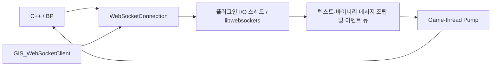

<!-- Copyright (c) 2026 Prayslaks. SPDX-License-Identifier: MIT -->

# WebSocket 연결 계층

> 부분 갱신 일자: 2026-09-25 — 독립 WebSocket 핸들, C++·BP API와 FastAPI 예제·자동 테스트 추가.

> 부분 갱신 일자: 2026-09-25 — 엔진 래퍼의 UTF-8 손상을 플러그인 내부 libwebsockets 드라이버로 해결. 송신 상한 및 WSS 검증 추가.

## 목적과 범위

엔진에 포함된 libwebsockets/OpenSSL을 사용하는 지속적인 양방향 연결이다. HTTP 요청 Job·SSE와 별도의 상태와 수명을 갖는다. 텍스트는 FString, 바이너리는 완성된 메시지의 TArray<uint8>로 전달한다. JSON 구조체 변환은 기존 `ConvertJsonStringToStruct`를 사용한다. UE 5.7의 IWebSocket 텍스트 조립 문제 때문에 플러그인 내부 드라이버에서 수신 바이트를 직접 조립한다. 엔진 설치를 수정하거나 별도 라이브러리를 다운로드할 필요는 없다.

클라이언트용 `ws://`·`wss://` API다. Unreal 안에 WebSocket 서버를 생성하는 기능은 아니다. Provider별 이벤트 스키마·게임 JWT 갱신·자동 재연결은 호출 측 정책이다. `Options.Headers`에 필요한 Authorization을 전달할 수 있다.

## 빠른 시작 — UMG / Blueprint

서버 폴더에서 다음 명령을 실행한다.

```powershell
cd Plugins/JWNetworkUtility/TestServer
uv sync --locked
uv run uvicorn main:app --host 127.0.0.1 --port 5000 --reload
```

UMG에서 다음 순서로 구성한다.

1. `Create Web Socket Connection` → 반환값을 `UJWNU_WebSocketConnection` 변수에 저장한다. 게임 월드의 GameInstance가 필요하며 잘못된 WorldContext는 nullptr를 반환한다.
2. 변수에서 `Bind Event to On Connected`, `On Text Message`, `On Binary Message`, `On Error`, `On Closed`를 연결한다.
3. 핸들의 `Connect` 호출: URL은 **`ws://127.0.0.1:5000/ws/echo`**, Options는 기본값을 사용한다.
4. `On Connected`에서 Send 버튼을 활성화한다. 버튼 클릭 → 핸들의 `Send Text`에 `{"Text":"안녕 ✈","Index":1}`을 넣는다.
5. `On Text Message`에서 문자열을 표시하거나 JSON→USTRUCT 노드로 변환한다. 서버는 보낸 텍스트를 그대로 돌려준다.
6. `Send Binary`에 Byte 배열 `[0,1,127,128,255]`를 넣으면 `On Binary Message`로 같은 배열을 받는다.
7. 종료 버튼 → `Close(1000, "User closed")`. `On Closed`에서 UI 상태를 정리한다. 위젯을 닫을 때도 필요하면 직접 Close한다.

편의 노드 `Connect Web Socket`은 생성과 Connect를 합친다. 반환 직후 이벤트를 바인딩할 수 있도록 실제 연결은 다음 Tick에 시작한다. `Connect`의 true는 연결 시도 접수이며 실제 연결 성공은 `OnConnected`다.

**전체 URL을 넣는다.** HTTP 서비스의 Host 설정이나 Endpoint 합성은 사용하지 않는다. `http://` 주소나 `/ws/echo`만 입력하면 InvalidConfiguration 오류다.

에코 서버는 연결만으로 메시지를 보내지 않는다. 먼저 메시지를 보내거나 서버 푸시를 사용한다.

```text
ws://127.0.0.1:5000/ws/echo?push_count=3&delay=0.5
```

푸시는 `{"Kind":"push","Index":0,"Text":"안녕 ✈"}` 형식이며 지정한 개수 전송 후에도 연결을 유지한다. 텍스트 에코와 서버 푸시를 같은 연결에서 사용할 수 있다.

## C++ 예제

```cpp
// 소유 클래스에 UPROPERTY() TObjectPtr<UJWNU_WebSocketConnection> Connection;
Connection = UJWNU_GIS_WebSocketClient::CreateConnection(this);
if (!Connection) { return; }

Connection->OnConnectedNative.AddWeakLambda(this, [this]()
{
    Connection->SendText(TEXT("{\"Text\":\"hello\"}"));
});
Connection->OnTextMessageNative.AddWeakLambda(this, [this](const FString& Message)
{
    // JSON 해석 또는 게임/UI 이벤트로 전달한다.
});
Connection->OnClosedNative.AddWeakLambda(this, [this](const FJWNU_WebSocketCloseInfo& Info)
{
    // Info.Code / Reason / bWasClean / bWasLocal을 확인한다.
});

FJWNU_WebSocketOptions Options;
Options.Headers.Add(TEXT("X-JWNU-Test"), TEXT("example"));
Options.Protocols.Add(TEXT("jwnu.echo")); // 이 테스트 서버가 지원하는 선택적 서브프로토콜
Connection->Connect(TEXT("ws://127.0.0.1:5000/ws/echo"), Options);
```

필요한 헤더는 `JWNU_GIS_WebSocketClient.h`와 `JWNU_WebSocketConnection.h`다. 실행 중 연결은 서브시스템이 보관한다. Idle 및 종료된 핸들을 나중에 재사용하려면 호출 측에서도 UPROPERTY로 보관한다.

## API 계약

| 함수·이벤트 | 의미 |
| --- | --- |
| `Connect(URL, Options)` | Idle·Closed·Failed에서 연결 시도 접수. 실행 중 중복 호출은 false |
| `SendText / SendBinary` | 연결 중이고 메시지·송신 큐 상한 이내면 전송 접수. true는 상대 수신 확인이 아님 |
| `Close(Code, Reason)` | 종료 협상 시작. 연결 중에도 취소 가능. 중복 종료·잘못된 code/reason은 false |
| `GetState / IsConnected / IsActive` | 상태 조회. IsActive에는 Connecting·Connected·Closing 포함 |
| `OnConnected` | 협상 성공 |
| `OnTextMessage / OnBinaryMessage` | 텍스트·완성된 바이너리 메시지 |
| `OnError` | 구성·연결·시간·버퍼 오류. 이어서 OnClosed 발생 |
| `OnClosed` | 연결 시도당 한 번인 최종 알림 |

기본 상태 흐름은 Idle → Connecting → Connected → Closing → Closed다. 실패는 Failed이며, 서버가 닫으면 Connected에서 바로 종료될 수 있다. 이벤트는 모두 게임 스레드에서 호출한다. Close 요청 이후에는 남은 수신 데이터를 전달하지 않으며 아직 보내지 않은 송신 큐도 flush하지 않는다. 마지막 메시지의 처리가 필요하면 상대 ACK를 받은 뒤 Close한다.

기본 idle timeout과 전체 연결 시간 제한은 없다. 원격 종료·사용자 Close·네트워크 실패·월드/GameInstance 종료까지 유지한다. 물리적으로 끊어진 상대를 알아내는 시점은 전송 라이브러리 및 서버의 ping/timeout 정책에 달려 있다. 이 계층은 별도 application heartbeat를 삽입하지 않는다.

정상 Close는 상대와 종료 협상을 기다린다. 응답이 CloseTimeoutSeconds 안에 없으면 로컬에서 1006·bWasClean=false로 정리한다. 월드 정리도 기다리지 않고 1001·bWasLocal=true·bWasClean=false로 정리한다. 1006은 네트워크로 보내는 close code가 아니다.

Close code는 1000~1014 중 1004·1005·1006을 제외한 값 또는 3000~4999를 받는다. Reason은 UTF-8 123바이트까지다. 연결 시작 전 Close는 OnConnected 없이 OnClosed가 발생한다.

재연결은 종료 콜백이 반환된 **다음 Tick 이후** 같은 핸들의 Connect로 수행한다. 종료 알림 도중 Connect는 false다. 재연결 시 이전 소켓·버퍼를 폐기하고 새 소켓을 생성한다. 자동 메시지 재전송과 오프라인 송신 버퍼는 없다. 재접속 후 서버 측 세션 복구와 중복 처리는 서비스가 정한다.

## 구조와 제한



- `GIS_WebSocketClient`가 실행 중 핸들을 UPROPERTY로 보관하고 해당 월드 정리 시 종료한다.
- 연결마다 I/O 스레드 한 개가 libwebsockets를 구동하고 공유 수신 큐에 값을 복사한다. 대기 중에는 service wakeup을 사용한다. CoreTicker가 큐를 처리하므로 UObject와 BP는 게임 스레드에서만 접근한다.
- 종료 시 큐를 닫고 I/O 스레드를 깨워 정리한 뒤 join한다. DNS 해석 등 라이브러리의 동기 작업이 진행 중이면 그 작업의 반환까지 정리가 지연될 수 있다. 많은 동시 연결을 운용하려면 공용 I/O 스레드로 확장할 여지가 있다.
- 콜백 중 GC·월드 정리에 대비해 처리 중인 핸들과 순회 스냅샷을 강하게 보관한다.
- 텍스트·바이너리는 프레임의 최종 조각과 남은 payload를 확인하여 조립한다. 텍스트는 메시지 전체를 모은 다음 UTF-8로 한 번만 변환한다.
- 텍스트·바이너리는 같은 수신 큐에 도착 순서대로 들어간다. 재접속을 넘는 메시지 순서·중복 처리는 서비스가 결정한다.

| 옵션 | 기본값 | 의미 |
| --- | --- | --- |
| Headers | 빈 맵 | Upgrade 요청 헤더 |
| Protocols | 빈 배열 | 협상할 서브프로토콜 |
| ConnectTimeoutSeconds | 15초 | 연결 성공까지의 제한. 0은 해제 |
| CloseTimeoutSeconds | 3초 | 종료 협상 대기 상한 |
| MaxMessageBytes | 1 MiB | 한 메시지 송수신 상한 |
| MaxQueuedBytes | 4 MiB | 수신 큐·부분 텍스트·바이너리 및 항목 비용 상한 |
| MaxSendQueuedBytes | 4 MiB | libwebsockets에 전달하기 전 송신 메시지·항목 비용 상한 |

헤더·프로토콜·URL의 기본 유효성을 검사한다. 메시지 크기나 송신 큐 상한을 초과한 송신은 false이며 연결을 유지한다. 수신 상한 초과는 BufferLimit로 종료한다. 비용 상한은 논리적 payload·항목 기준이며 TArray 예약 용량, 변환 시 임시 메모리, 라이브러리·TLS·OS 버퍼 전체의 메모리 상한을 의미하지 않는다. true는 상대 처리 완료가 아니므로 고속 지속 송신에는 서비스 수준의 ACK·전송량 제어가 필요하다.

검증 대상은 UE 5.7 / Win64다. Build.cs가 엔진의 libWebSockets·OpenSSL·zlib 및 SSL 모듈을 참조한다. WSS는 TLS 1.2 이상, 엔진의 인증서 저장소·인증서 검증 정책을 사용한다. 인증서 검증을 끄는 옵션은 제공하지 않는다.

WSS는 인증서와 일치하는 DNS 이름을 사용한다. 엔진에 포함된 libwebsockets 3.0의 hostname 검사에서는 IP SAN만 가진 인증서로 IP 주소에 접속하면 hostname mismatch가 발생할 수 있다. 로컬 WSS 시험은 `localhost`와 IPv4·IPv6 모두에 바인딩한 서버를 사용한다. 일반 WS 예제는 `127.0.0.1`이다.

### 구현 결정 — 엔진의 UTF-8 텍스트 조립 문제 우회

최초 IWebSocket 래퍼 구현에서 `안녕 ✈🙂`를 20,000회 반복한 텍스트의 에코 내용이 원문과 달라졌다. 작은 한글 JSON과 300KB 바이너리 왕복은 통과했지만 큰 UTF-8 텍스트 검사는 실패했다. 작은 메시지도 UTF-8 문자 중간에서 수신 조각이 나뉘면 같은 원인에 노출될 수 있다.

원인은 엔진 `Private/Lws/LwsWebSocket.cpp:312`다. 각 수신 조각을 먼저 `FUTF8ToTCHAR`로 변환한 뒤 FString을 누적한다. 조각 끝이 다중 바이트 문자 중간이면 다음 조각과 합쳐 복원하지 못한다. 최초 래퍼의 `OnMessage`는 이미 손상된 FString을 받았다. `OnRawMessage`에는 메시지 종류 및 WebSocket 메시지의 최종 조각 여부가 함께 제공되지 않아 범용 텍스트·바이너리 혼용 연결을 안전하게 대체할 수 없다.

[엔진 수정 후보](EnginePatches/UE5.7-WebSocket-UTF8.patch)는 바이트 배열로 누적하고 메시지가 완성된 시점에 변환한다. 설치된 엔진 원본에 대한 `git apply --check --unidiff-zero --ignore-space-change`만 통과했다. **실제 엔진에는 적용하지 않았으며 패치의 컴파일·런타임 검증도 하지 않았다.** Launcher 엔진의 소스 파일만 수정해서는 설치된 바이너리가 바뀌지 않는다. 실제 해결에는 수정된 엔진 모듈을 빌드·사용하거나 플러그인 내부에 별도 백엔드를 제공해야 한다.

최종 구현은 `JWNU_WebSocketTransport`가 같은 libwebsockets 라이브러리를 직접 사용하고 `JWNU_WebSocketReceiveQueue::PushTextFragment`에서 바이트를 조립한다. 따라서 엔진 패치 없이 `Large fragmented UTF-8 text preserved` 검증이 통과한다. 엔진 수정 후보는 원인 분석 자료이며 현재 플러그인의 적용 전제 조건이 아니다.

## 테스트 서버·독립 예제

서버 실행 후 같은 TestServer 폴더의 다른 터미널에서:

```powershell
uv run python websocket_demo.py
```

텍스트 JSON과 바이너리 배열을 왕복하고 정상 종료한다. 원격 주소는 `--url ws://HOST:PORT/ws/echo`로 변경한다.

| 서버 경로 | 동작 |
| --- | --- |
| `/ws/echo` | 인증 없는 텍스트·바이너리 에코 |
| `?push_count=3&delay=0.5` | 독립 서버 푸시 후 연결 유지 |
| `?mode=headers` | X-JWNU-Test와 협상된 Protocol을 JSON으로 통지 |
| `?mode=server_close` | 서버가 4001로 정상 종료 |
| `?mode=drop` | 고의 예외로 전송 중단 |
| `?mode=reject` | Upgrade 거절 |
| `?mode=before_open` | 연결 수락을 1초 지연 |
| `?mode=large_binary / large_text` | 4096바이트 메시지로 크기 제한 시험 |

WebSocket 라우트는 HTTP Swagger 문서에 나타나지 않으므로 위 경로로 연결한다. 이 예제는 게임 JWT HTTP 미들웨어를 통과하는 인증 예제가 아니며 별도 인증 로직은 없다.

## 자동 검증

프로젝트 루트에서 Editor 타깃 빌드 후:

```powershell
uv run --locked --project Plugins/JWNetworkUtility/TestServer python Plugins/JWNetworkUtility/TestServer/run_websocket_tests.py --engine "C:/Program Files/Epic Games/UE_5.7" --project ProjectZK.uproject
```

실행기는 전용 서버를 127.0.0.1:18573에 띄우고 Python 예제 및 UnrealEditor-Cmd 테스트를 실행한 뒤 서버를 정리한다. 포트 변경은 `--port`를 사용한다. 기존 SSE 실행기는 기존 명령을 유지한다.

- `JWNetworkUtility.WebSocket.ReceiveQueue`: 모든 UTF-8·바이너리 분할 경계, 문자열 내 NUL, 빈 바이너리, 부분 메시지 크기·큐 상한, 종료 후 입력 차단.
- `JWNetworkUtility.WebSocket.FastAPI`: 17개 시나리오. 실제 BP 이벤트 그래프와 네이티브 콜백, 한글 JSON·큰 UTF-8 텍스트·300KB 바이너리·빈 메시지 왕복, 서버 푸시, 헤더·서브프로토콜, 정상·비정상·거절 종료, 잘못된 URL·헤더, 시간·수신 상한, 연결 전·연결 중 취소, 동일 핸들 재연결, 송신 거절, GC, 월드·GameInstance 정리, 콜백 도중 종료.
- 통합 실행 플래그가 없으면 FastAPI 테스트는 생략 사실을 기록한다. 서버를 필요로 하는 검증은 실행기를 사용한다.
- 결과는 `Saved/Automation/JWNUWebSocket-<시각>/index.json`, `Unreal.log`, `fastapi.log`다. 고의 실패 시나리오에서는 엔진·서버의 경고가 정상적으로 기록될 수 있다.

WSS는 실행기에 `--tls-cert <cert.pem> --tls-key <key.pem>`를 추가한다. 인증서는 `localhost` DNS SAN 및 건강 검사에 쓰는 `127.0.0.1` IP SAN을 포함해야 한다. 실행기는 해당 인증서를 **시험 UE 프로세스의 명령행 INI override로만** 신뢰시킨다. `--expect-untrusted-tls`를 더하면 UE에 시험 CA를 주지 않고 인증서 거절·OnConnected 미발생을 검증한다. 프로젝트 Config와 운영체제 인증서 저장소는 변경하지 않는다.

2026-09-25 검증: 최초 엔진 래퍼의 실패 재현은 `JWNUWebSocket-20260925-153811`이다. 플러그인 드라이버 적용 후 WS `JWNUWebSocket-20260925-155729`, WSS `JWNUWebSocket-20260925-160615`는 Python 예제 및 Unreal 2개 테스트 모두 통과했다. 두 실행 모두 17개 연결 시나리오와 큰 UTF-8 회귀 검사를 포함한다. 결과의 INI 경고는 기존 HTTP Host 설정 경로 경고다.

Editor·Game 타깃 빌드 성공. 미신뢰 인증서 거절 시험 `JWNUWebSocket-20260925-160718`도 2개 테스트 모두 통과했다.

SSE 회귀 `JWNUSse-20260925-160853`도 2개 테스트 모두 통과했다.

## 구현 위치

| 파일 | 책임 |
| --- | --- |
| [JWNU_WebSocketTypes.h](../Source/JWNetworkUtility/Public/JWNU_WebSocketTypes.h) | 상태·오류·옵션·이벤트 타입 |
| [JWNU_WebSocketConnection.h](../Source/JWNetworkUtility/Public/JWNU_WebSocketConnection.h) | 연결 핸들 C++·BP 공개 API |
| [JWNU_GIS_WebSocketClient.cpp](../Source/JWNetworkUtility/Private/JWNU_GIS_WebSocketClient.cpp) | 활성 연결·월드 수명 |
| [JWNU_WebSocketReceiveQueue.h](../Source/JWNetworkUtility/Private/JWNU_WebSocketReceiveQueue.h) | 스레드 간 수신 큐·UTF-8 및 바이너리 조립 |
| [JWNU_WebSocketTransport.cpp](../Source/JWNetworkUtility/Private/JWNU_WebSocketTransport.cpp) | libwebsockets I/O 스레드·송신 큐·TLS·프레임 수신 |
| [JWNU_BFL_WebSocketClient.h](../Source/JWNetworkUtility/Public/JWNU_BFL_WebSocketClient.h) | BP 생성·연결 편의 노드 |
| [websocket_examples.py](../TestServer/websocket_examples.py) | FastAPI 에코·푸시·오류 시나리오 |
| [websocket_demo.py](../TestServer/websocket_demo.py) | Python 송수신 예제 |

외부 근거: [FastAPI WebSocket](https://fastapi.tiangolo.com/advanced/websockets/). 엔진 근거는 UE 5.7 `Runtime/Online/WebSockets/Public/IWebSocket.h`와 기본 libwebsockets 백엔드 구현이다.
