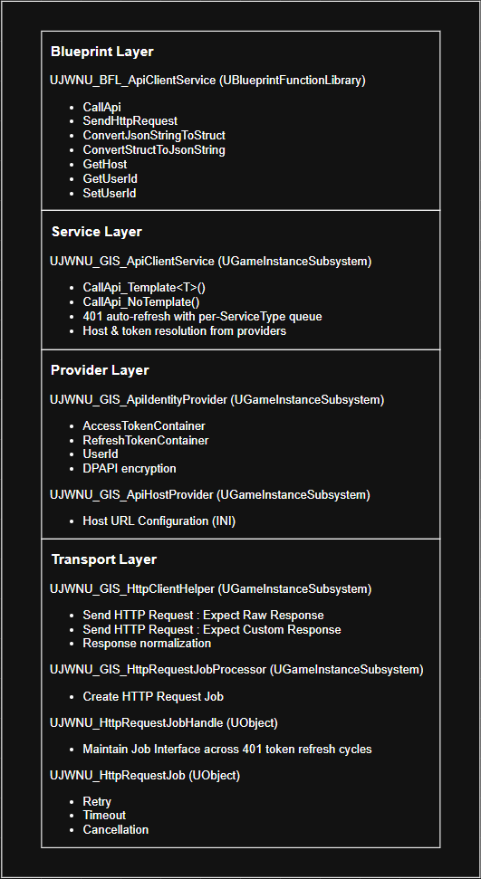
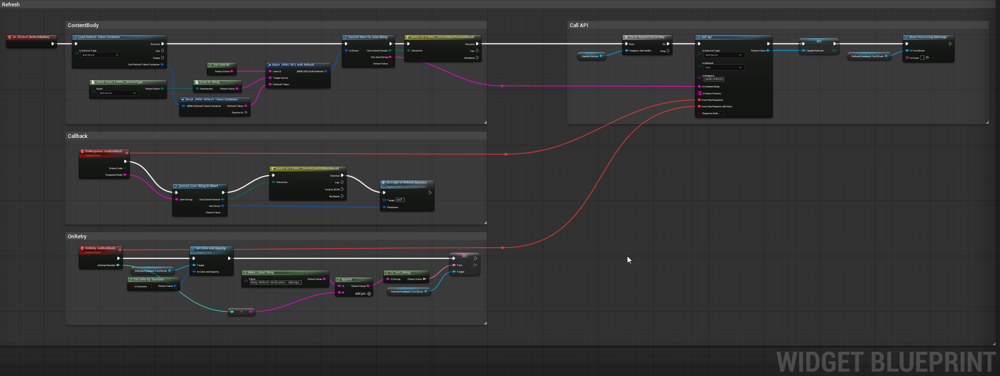
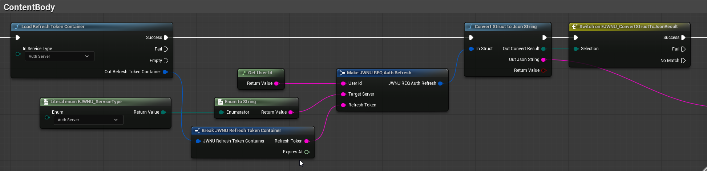
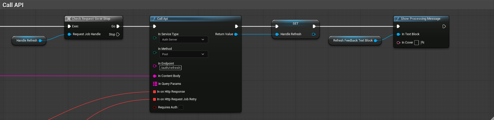

# JWNetworkUtility Plugin

A standalone Unreal Engine 5.6 plugin providing a layered HTTP API client system with JWT authentication, automatic token refresh, retry/timeout handling, and Blueprint support.

**Engine:** Unreal Engine 5.6 | **Author:** prayslaks | **Status:** Beta

**한국어 문서는 [README_ko.md](./README_ko.md)를 참고하세요.**

## ☕ Support
If this project helped you, please consider buying me a coffee to support further development!

[](https://www.buymeacoffee.com/prayslaks)

## Table of Contents

- [Quick Start \& Testing](#-quick-start--testing)
- [Features](#features)
- [Module Structure](#module-structure)
- [Architecture](#architecture)
- [Core Class List](#core-class-list)
- [Usage](#usage)
  - [C++](#c)
- [HTTP Response Modes](#http-response-modes)
  - [Raw Response](#raw-response-sendrequest_rawresponse)
  - [Custom Response](#custom-response-sendrequest_customresponse)
  - [401 Auto-Refresh Flow](#401-auto-refresh-flow)
  - [Token Security](#token-security)
- [Scalable Host Configuration](#scalable-host-configuration)
- [Console Variables](#console-variables)
- [Test Server (FastAPI)](#test-server-fastapi)
- [File Structure](#file-structure)
- [License](#license)

## 🚀 Quick Start & Testing

This plugin includes everything you need for immediate testing:
* **Test Server:** A Python 3.14.3 based server (`main.py`) is included.
* **Pre-built Executable:** A ready-to-run `.exe` is provided for quick verification.
* **In-Engine Assets:** The plugin content folder contains a dedicated **Test Level** and **UMG** to help you get started right away.

## Features

- JWT Access/Refresh Token management (Windows DPAPI encryption)
- Automatic HTTP Request Retry with HTTP Request Job (5xx, timeout, network errors)
- Automatic token refresh and request retry queue on 401 responses
- Per-ServiceType host URL/token separation and Host Configuration Scalability (`GameServer`, `AuthServer`, `etc`)
- Raw HTTP Response Support
- Custom HTTP Response Normalization Support (non-2xx → consistent JSON structure)
- C++ template API (`CallApi_Template<T>`) and Blueprint Support
- Blueprint wildcard struct parsing (`CustomThunk`): JSON ↔ USTRUCT Conversion
- Pre-built request/response structs (`FJWNU_REQ_*`, `FJWNU_RES_*`) matching test server API

## Module Structure

| Module | Type | Description                                                            |
|---|---|------------------------------------------------------------------------|
| `JWNetworkUtility` | Runtime | Core plugin — HTTP Job, HTTP Client, API Client, Token Provider, Host Provider |
| `JWNetworkUtilityTest` | Runtime | Test/demo module — API test actor                                      |

## Architecture



## Core Class List

| Class                               | Base | Role |
|-------------------------------------|---|---|
| `UJWNU_GIS_ApiClientService`        | GameInstanceSubsystem | High-level API: template parsing, 401 refresh queue |
| `UJWNU_GIS_HttpClientHelper`        | GameInstanceSubsystem | Low-level HTTP: raw/normalized responses |
| `UJWNU_GIS_HttpRequestJobProcessor` | GameInstanceSubsystem | Job creation, query param encoding |
| `UJWNU_GIS_ApiIdentityProvider`     | GameInstanceSubsystem | Token + UserId/SessionId storage, DPAPI encryption |
| `UJWNU_GIS_ApiHostProvider`         | GameInstanceSubsystem | Host URLs from INI config |
| `UJWNU_HttpRequestJob`              | UObject | Single request lifecycle: retry, timeout, cancel |
| `UJWNU_BFL_ApiClientService`        | BlueprintFunctionLibrary | Blueprint-exposed API |
| `UJWNU_BFL_AuthWidgetHelper`        | BlueprintFunctionLibrary | Auth widget validation helpers (email, password) |

## Usage

### C++

```cpp
const auto Callback = 
    FOnHttpRequestCompletedDelegate::CreateLambda([](const int32 StatusCode, const FString& ResponseBody)
    {
        PRINT_LOG(LogJWNU_Actor_ApiTest, Display, TEXT("Raw Response From Server : %s"), *ResponseBody);
    });
    
FString ProvidedHost;
if (UJWNU_GIS_ApiHostProvider::Get(GetWorld())->GetHost(EJWNU_ServiceType::AuthServer, ProvidedHost))
{
    return;	
}

const FString URL = ProvidedHost + TEXT("/health");
const FString AuthToken = {};
const FString ContentBody = {};
const TMap<FString, FString> QueryParams = {};

UJWNU_GIS_HttpClientHelper::SendReqeust_RawResponse(
    GetWorld(), 
    EJWNU_HttpMethod::Get, 
    URL, 
    AuthToken, 
    ContentBody, 
    QueryParams, 
    Callback);
```

```cpp
const auto Callback = 
    [](const FJWNU_RES_Base& Response)
    {
        PRINT_LOG(LogJWNU_Actor_ApiTest, Display, TEXT("Custom Reseponse From Server : %s %s"), *Response.Code, *Response.Message);
    };
    
const FString Endpoint = TEXT("/health");
const FString ContentBody = {};
const TMap<FString, FString> QueryParams = {};

UJWNU_GIS_ApiClientService::CallApi_Template<FJWNU_RES_Base>(
    GetWorld(), 
    EJWNU_HttpMethod::Get, 
    EJWNU_ServiceType::AuthServer, 
    Endpoint, 
    ContentBody, 
    QueryParams, 
    Callback);
```

```cpp
const auto Callback = 
    FOnHttpResponseDelegate::CreateLambda([](const EJWNU_HttpStatusCode StatusCode, const FString& ResponseBody)
    {
        PRINT_LOG(LogJWNU_Actor_ApiTest, Display, TEXT("Raw Response From Server : %s"), *ResponseBody);
    });
    
const FString Endpoint = TEXT("/health");
const FString ContentBody = {};
const TMap<FString, FString> QueryParams = {};

UJWNU_GIS_ApiClientService::CallApi_NoTemplate(
    GetWorld(), 
    EJWNU_HttpMethod::Get, 
    EJWNU_ServiceType::AuthServer, 
    Endpoint, 
    ContentBody, 
    QueryParams, 
    Callback);
```

### Blueprint
  




## HTTP Response Modes

`UJWNU_GIS_HttpClientHelper` provides two response modes. Choose the one that fits your server architecture.

### Raw Response (`SendRequest_RawResponse`)

A fully general-purpose mode. The server's HTTP response body is passed through to the callback **as-is**, with no transformation. Use this when:
- Your server already returns a well-defined JSON structure you want to handle directly.
- You need full control over response parsing (e.g., binary data, non-JSON formats, third-party APIs).

```
Server Response (any format) ──► Callback receives the body unchanged
```

### Custom Response (`SendRequest_CustomResponse`)

A normalization mode that converts **every** response into a consistent `{success, code, message}` JSON structure. This is useful when your server follows a convention like:

```json
{"Success": true, "Code": "CODE", "Message": "message"}
```

**How it works:**

| Condition | Callback receives |
|---|---|
| **2xx** | Original JSON from server (passed through) |
| **non-2xx** | `{"success": false, "code": "<CUSTOM_CODE>", "message": "<CUSTOM_MESSAGE>"}` |
| **Network error** | `{"success": false, "code": "NETWORK_ERROR", "message": "Failed to Send HTTP Request"}` |

**Why use this?**

- **Separation of concerns:** Network-level failures (timeout, DNS, connectivity) are clearly distinguished from service-level failures (400, 403, 500). Your game logic only needs to check `success` and `code` without inspecting raw HTTP status codes.
- **Custom code mapping:** The `StatusCodeToCustomCodeMap` / `StatusCodeToCustomMessageMap` inside `UJWNU_GIS_HttpClientHelper` translate HTTP status codes into application-specific codes (e.g., `401 → "UNAUTHORIZED"`, `503 → "SERVICE_UNAVAILABLE"`). You can modify these maps to define your own codes and route different error codes to different UI flows or retry strategies.
- **Uniform parsing:** Every response—success or failure—shares the same JSON shape, so a single USTRUCT (like `FJWNU_RES_Base`) can deserialize any outcome.

**Trade-offs:**

- The original HTTP response body is **discarded** for non-2xx responses. If your server embeds meaningful error details in non-2xx bodies, Raw Response mode is more appropriate.
- The normalization logic is opinionated. If your server uses a different envelope structure, you will need to modify `SendRequest_CustomResponse` in `JWNU_GIS_HttpClientHelper.cpp` to match your server's convention.

### 401 Auto-Refresh Flow

1. API call returns 401
2. Request queued in `PendingJobQueues[ServiceType]`
3. Single refresh request per ServiceType (`RefreshInProgressFlags`)
4. Calls `/auth/refresh` endpoint
5. On success: update token, drain queue (re-send all pending)
6. On failure: drain queue with error

### Token Security

- **Access Token**: Stored in-memory in `FJWNU_AccessTokenContainer` (per-ServiceType, with `ExpiresAt`)
- **Refresh Token**: Stored in `FJWNU_RefreshTokenContainer`, encrypted via Windows DPAPI (`CryptProtectData`/`CryptUnprotectData`) with Device ID entropy salt, saved to `Saved/Config/JWNetworkUtility/auth_{ServiceType}.bin`
- **UserId**: Memory-only FString (set from login/refresh response, managed via `GetUserId`/`SetUserId`)

## Scalable Host Configuration

### Host URL (`Config/DefaultJWNetworkUtility.ini`)

```ini
[/Script/JWNetworkUtility.JWNU_GIS_ApiHostProvider]
GameServer="127.0.0.1:5000"
AuthServer="127.0.0.1:5000"
```

Override in host project: add the same section to the project's `DefaultJWNetworkUtility.ini`.

### UENUM EJWNU_ServiceType (`Source/JWNetworkUtility/Public/JWNetworkUtilityTypes.h`)

```cpp
UENUM(BlueprintType)
enum class EJWNU_ServiceType : uint8
{
    GameServer,
    AuthServer,
};
```

### UJWNU_GIS_ApiHostProvider::Initialize (`Source/JWNetworkUtility/Private/JWNU_GIS_ApiHostProvider`)

```cpp
void UJWNU_GIS_ApiHostProvider::Initialize(FSubsystemCollectionBase& Collection)
{
	Super::Initialize(Collection);
	
	const FString Section = TEXT("/Script/JWNetworkUtility.JWNU_GIS_ApiHostProvider");
	FString PluginDir = IPluginManager::Get().FindPlugin(TEXT("JWNetworkUtility"))->GetBaseDir();
	const FString ConfigPath = FPaths::Combine(PluginDir, TEXT("Config"), TEXT("DefaultJWNetworkUtility.ini"));
	PRINT_LOG(LogJWNU_GIS_ApiHostProvider, Display, TEXT("호스트 주소 로드 시도 : %s"), *ConfigPath);
	
	auto TryLoad = [&](const EJWNU_ServiceType Type, const TCHAR* Key)
	{
		if (FString Value; GConfig->GetString(*Section, Key, Value, ConfigPath))
		{
			ServiceTypeToHostMap.Add(Type, Value);
			PRINT_LOG(LogJWNU_GIS_ApiHostProvider, Display, TEXT("호스트 주소 로드 완료 — %s : %s"), Key, *Value);
		}
		else
		{
			PRINT_LOG(LogJWNU_GIS_ApiHostProvider, Warning, TEXT("호스트 주소 로드 실패 - %s : ???"), Key);
		}
	};

	TryLoad(EJWNU_ServiceType::GameServer, TEXT("GameServer"));
	TryLoad(EJWNU_ServiceType::AuthServer, TEXT("AuthServer"));
}
```

## Console Variables

| CVar | Default | Description |
|---|---|---|
| `JWNU.DebugScreen` | `false` | Toggle on-screen debug messages for the token refresh flow |

## Test Server (FastAPI)

### Quick Start (Pre-built Executable)

Includes build files that can be run immediately without setting up a Python environment.

```bash
TestServer/dist/main.exe
```

### From Source

```bash
cd TestServer
cp .env.example .env   # edit as needed
pip install -r requirements.txt
uvicorn main:app --reload --port 5000
```

### Environment Variables (`.env`)

| Variable | Default | Description |
|---|---|---|
| `LOG_LANG` | `ko` | Server log language (`ko` / `en`) |
| `SMTP_HOST` | *(empty)* | SMTP host (if unset, auth codes printed to console) |
| `SMTP_PORT` | `587` | SMTP port |
| `SMTP_USER` | *(empty)* | SMTP account |
| `SMTP_PASSWORD` | *(empty)* | SMTP password |
| `SMTP_FROM` | `SMTP_USER` | Sender email address |

### Endpoints

| Method | Path | Auth | Description |
|---|---|---|---|
| GET | `/health` | No | Health check |
| GET | `/timeout` | No | Timeout simulation (`?second=N`, max 60s) |
| POST | `/auth/register/send-code` | No | Send email verification code |
| POST | `/auth/register/verify-code` | No | Verify code |
| POST | `/auth/register` | No | Complete registration |
| POST | `/auth/login` | No | Login (JWT issued) |
| POST | `/auth/refresh` | No | Token refresh (single-use refresh token) |
| POST | `/auth/logout` | Yes | Logout (blacklist access token, revoke refresh tokens) |
| POST | `/auth/reset` | No | Clear all users, verifications, tokens |
| GET/POST/PUT/DELETE | `/api/data` | Yes | CRUD test (supports `?delay=N&status=CODE` simulation) |
| GET | `/debug/users/registered` | No | List registered users (dev) |
| GET | `/debug/users/active` | No | Active sessions (dev) |
| GET | `/debug/verifications` | No | Verification code status (dev) |

## File Structure

```
JWNetworkUtility/
├── Config/DefaultJWNetworkUtility.ini
├── Content/
├── Resources/Icon128.png
├── Source/
│   ├── JWNetworkUtility/              (Runtime)
│   │   ├── JWNetworkUtility.Build.cs
│   │   ├── Public/
│   │   │   ├── JWNetworkUtility.h
│   │   │   ├── JWNetworkUtilityTypes.h
│   │   │   ├── JWNetworkUtilityDelegates.h
│   │   │   ├── JWNU_GIS_ApiClientService.h
│   │   │   ├── JWNU_GIS_HttpClientHelper.h
│   │   │   ├── JWNU_GIS_HttpRequestJobProcessor.h
│   │   │   ├── JWNU_GIS_ApiIdentityProvider.h
│   │   │   ├── JWNU_GIS_ApiHostProvider.h
│   │   │   ├── JWNU_GIS_CustomCodeHelper.h
│   │   │   ├── JWNU_GIS_SteamWorks.h
│   │   │   ├── JWNU_HttpRequestJob.h
│   │   │   ├── JWNU_BFL_ApiClientService.h
│   │   │   └── JWNU_BFL_AuthWidgetHelper.h
│   │   └── Private/
│   │       ├── JWNetworkUtility.cpp
│   │       ├── JWNetworkUtilityTypes.cpp
│   │       ├── JWNetworkUtilityDelegates.cpp
│   │       ├── JWNU_GIS_ApiClientService.cpp
│   │       ├── JWNU_GIS_HttpClientHelper.cpp
│   │       ├── JWNU_GIS_HttpRequestJobProcessor.cpp
│   │       ├── JWNU_GIS_ApiIdentityProvider.cpp
│   │       ├── JWNU_GIS_ApiHostProvider.cpp
│   │       ├── JWNU_GIS_CustomCodeHelper.cpp
│   │       ├── JWNU_GIS_SteamWorks.cpp
│   │       ├── JWNU_HttpRequestJob.cpp
│   │       ├── JWNU_BFL_ApiClientService.cpp
│   │       └── JWNU_BFL_AuthWidgetHelper.cpp
│   └── JWNetworkUtilityTest/          (Runtime, depends on JWNetworkUtility)
│       ├── JWNetworkUtilityTest.Build.cs
│       ├── Public/
│       │   ├── JWNetworkUtilityTest.h
│       │   └── JWNU_Actor_ApiTest.h
│       └── Private/
│           ├── JWNetworkUtilityTest.cpp
│           └── JWNU_Actor_ApiTest.cpp
├── TestServer/
│   ├── main.py
│   ├── requirements.txt
│   ├── .env.example
│   ├── openapi.json
│   └── dist/
│       └── main.exe
├── Doxygen/
├── Analysis/                      (gitignored, analysis artifacts)
├── JWNetworkUtility.uplugin
├── CLAUDE.md
├── LICENSE
├── README_ko.md
└── README.md
```

## License

See `LICENSE` file.
