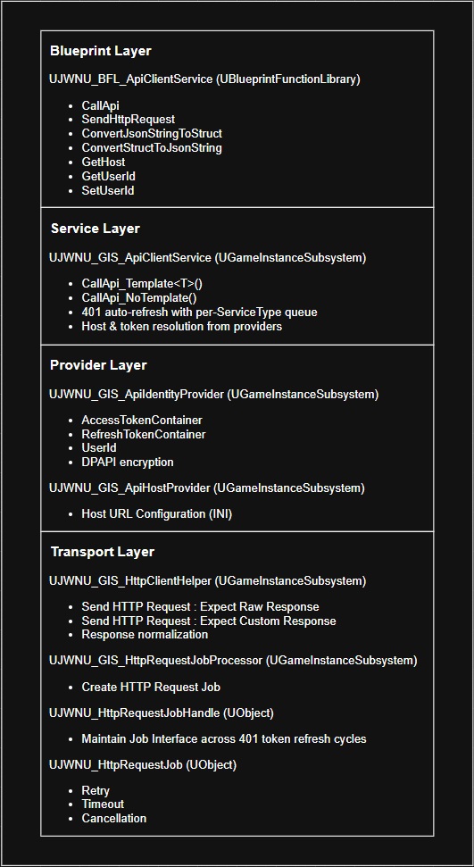
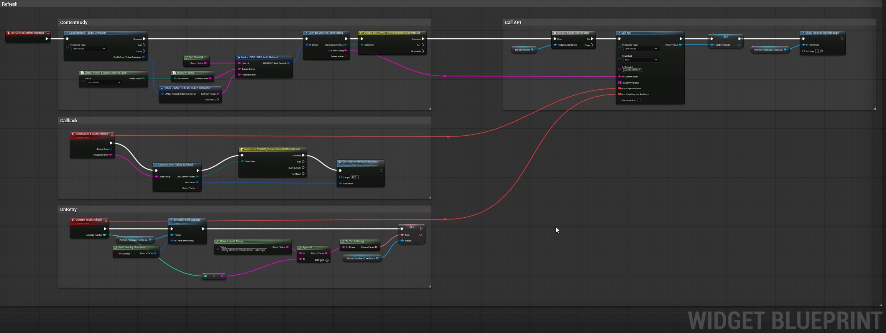

# JWNetworkUtility Plugin

A standalone Unreal Engine 5.6+ plugin providing a layered HTTP API client system with JWT authentication, automatic token refresh, retry/timeout handling, and Blueprint support.

**Engine:** Unreal Engine 5.6+ | **Author:** prayslaks | **Status:** Beta

## Table of Contents

- [Features](#features)
- [Module Structure](#module-structure)
- [Architecture](#architecture)
- [Core Class List](#core-class-list)
- [Usage](#usage)
- [Documentation](#documentation)
- [File Structure](#file-structure)
- [License](#license)

## ☕ Support
If this project helped you, please consider buying me a coffee to support further development!

[](https://www.buymeacoffee.com/prayslaks)

## Features

- JWT Access/Refresh Token management (Windows DPAPI encryption)
- Automatic HTTP Request Retry with HTTP Request Job (5xx, timeout, network errors)
- Automatic token refresh and request retry queue on 401 responses
- Per-ServiceType host URL/token separation and Host Configuration Scalability (`GameServer`, `AuthServer`, `etc`)
- Raw HTTP Response Support
- Custom HTTP Response Normalization Support (non-2xx → consistent JSON structure)
- C++ template API (`CallApi_Template<T>`) and Blueprint Support
- Blueprint wildcard struct parsing (`CustomThunk`): JSON ↔ USTRUCT Conversion
- Pre-built request/response structs (`FJWNU_REQ_*`, `FJWNU_RES_*`) matching test server API
- Request Job Handle (`UJWNU_HttpRequestJobHandle`): exposes `Cancel`, `IsRunning`, `IsCancelled` to C++ and Blueprint; handle remains valid across 401 token refresh cycles

## Module Structure

| Module | Type | Description |
|---|---|---|
| `JWNetworkUtility` | Runtime | Core plugin — HTTP Job, HTTP Client, API Client, Token Provider, Host Provider |
| `JWNetworkUtilityTest` | Runtime | Test/demo module — API test actor |

## Architecture



## Core Class List

| Class | Base | Role |
|---|---|---|
| `UJWNU_GIS_ApiClientService` | GameInstanceSubsystem | High-level API: template parsing, 401 refresh queue |
| `UJWNU_GIS_HttpClientHelper` | GameInstanceSubsystem | Low-level HTTP: raw/normalized responses |
| `UJWNU_GIS_HttpRequestJobProcessor` | GameInstanceSubsystem | Job creation, query param encoding |
| `UJWNU_GIS_ApiIdentityProvider` | GameInstanceSubsystem | Token + UserId/SessionId storage, DPAPI encryption |
| `UJWNU_GIS_ApiHostProvider` | GameInstanceSubsystem | Host URLs from INI config |
| `UJWNU_HttpRequestJob` | UObject | Single request lifecycle: retry, timeout, cancel |
| `UJWNU_HttpRequestJobHandle` | UObject (BlueprintType) | Logical request handle: survives 401 refresh, exposes `Cancel`/`IsRunning`/`IsCancelled` |
| `UJWNU_BFL_ApiClientService` | BlueprintFunctionLibrary | Blueprint-exposed API |
| `UJWNU_BFL_AuthWidgetHelper` | BlueprintFunctionLibrary | Auth widget validation helpers (email, password) |

## Usage

### C++

```cpp
const auto Callback =
    FOnHttpRequestCompletedDelegate::CreateLambda([](const int32 StatusCode, const FString& ResponseBody)
    {
        PRINT_LOG(LogJWNU_Actor_ApiTest, Display, TEXT("Raw Response From Server : %s"), *ResponseBody);
    });

FString ProvidedHost;
if (UJWNU_GIS_ApiHostProvider::Get(GetWorld())->GetHost(EJWNU_ServiceType::AuthServer, ProvidedHost))
{
    return;
}

const FString URL = ProvidedHost + TEXT("/health");
const FString AuthToken = {};
const FString ContentBody = {};
const TMap<FString, FString> QueryParams = {};

UJWNU_GIS_HttpClientHelper::SendRequest_RawResponse(
    GetWorld(),
    EJWNU_HttpMethod::Get,
    URL,
    AuthToken,
    ContentBody,
    QueryParams,
    Callback);
```

→ See [C++ Usage](https://github.com/prayslaks/JWNetworkUtility/wiki/Cpp-Usage) for template API and job handle patterns.

### Blueprint



→ See [Blueprint Usage](https://github.com/prayslaks/JWNetworkUtility/wiki/Blueprint-Usage) for nodes, struct conversion, and handle usage.

## Documentation

Full documentation is available on the [Wiki](https://github.com/prayslaks/JWNetworkUtility/wiki).

| Page | Description |
|---|---|
| [Getting Started](https://github.com/prayslaks/JWNetworkUtility/wiki/Getting-Started) | Installation, build, first API call |
| [Architecture](https://github.com/prayslaks/JWNetworkUtility/wiki/Architecture) | Layer diagram, class list, request flow |
| [C++ Usage](https://github.com/prayslaks/JWNetworkUtility/wiki/Cpp-Usage) | Template API calls, job handle patterns |
| [Blueprint Usage](https://github.com/prayslaks/JWNetworkUtility/wiki/Blueprint-Usage) | Blueprint nodes, struct conversion, handle usage |
| [Authentication Flow](https://github.com/prayslaks/JWNetworkUtility/wiki/Authentication-Flow) | JWT lifecycle, 401 auto-refresh, token security |
| [Configuration](https://github.com/prayslaks/JWNetworkUtility/wiki/Configuration) | INI settings, console variables |
| [Test Server](https://github.com/prayslaks/JWNetworkUtility/wiki/Test-Server) | FastAPI test server setup and endpoints |
| [API Reference](https://github.com/prayslaks/JWNetworkUtility/wiki/API-Reference) | Enums, structs, delegates |

## File Structure

```
JWNetworkUtility/
├── Config/DefaultJWNetworkUtility.ini
├── Content/
├── Resources/Icon128.png
├── Source/
│   ├── JWNetworkUtility/              (Runtime)
│   │   ├── JWNetworkUtility.Build.cs
│   │   ├── Public/
│   │   │   ├── JWNetworkUtility.h
│   │   │   ├── JWNetworkUtilityTypes.h
│   │   │   ├── JWNetworkUtilityDelegates.h
│   │   │   ├── JWNU_GIS_ApiClientService.h
│   │   │   ├── JWNU_GIS_HttpClientHelper.h
│   │   │   ├── JWNU_GIS_HttpRequestJobProcessor.h
│   │   │   ├── JWNU_GIS_ApiIdentityProvider.h
│   │   │   ├── JWNU_GIS_ApiHostProvider.h
│   │   │   ├── JWNU_GIS_CustomCodeHelper.h
│   │   │   ├── JWNU_GIS_SteamWorks.h
│   │   │   ├── JWNU_HttpRequestJob.h
│   │   │   ├── JWNU_HttpRequestJobHandle.h
│   │   │   ├── JWNU_BFL_ApiClientService.h
│   │   │   └── JWNU_BFL_AuthWidgetHelper.h
│   │   └── Private/
│   │       ├── JWNetworkUtility.cpp
│   │       ├── JWNetworkUtilityTypes.cpp
│   │       ├── JWNetworkUtilityDelegates.cpp
│   │       ├── JWNU_GIS_ApiClientService.cpp
│   │       ├── JWNU_GIS_HttpClientHelper.cpp
│   │       ├── JWNU_GIS_HttpRequestJobProcessor.cpp
│   │       ├── JWNU_GIS_ApiIdentityProvider.cpp
│   │       ├── JWNU_GIS_ApiHostProvider.cpp
│   │       ├── JWNU_GIS_CustomCodeHelper.cpp
│   │       ├── JWNU_GIS_SteamWorks.cpp
│   │       ├── JWNU_HttpRequestJob.cpp
│   │       ├── JWNU_HttpRequestJobHandle.cpp
│   │       ├── JWNU_BFL_ApiClientService.cpp
│   │       └── JWNU_BFL_AuthWidgetHelper.cpp
│   └── JWNetworkUtilityTest/          (Runtime, depends on JWNetworkUtility)
│       ├── JWNetworkUtilityTest.Build.cs
│       ├── Public/
│       │   ├── JWNetworkUtilityTest.h
│       │   └── JWNU_Actor_ApiTest.h
│       └── Private/
│           ├── JWNetworkUtilityTest.cpp
│           └── JWNU_Actor_ApiTest.cpp
├── TestServer/
│   ├── main.py
│   ├── requirements.txt
│   ├── .env.example
│   ├── openapi.json
│   └── dist/
│       └── main.exe
├── Doxygen/
├── Analysis/                      (gitignored, analysis artifacts)
├── JWNetworkUtility.uplugin
├── CLAUDE.md
├── LICENSE
├── README_ko.md
└── README.md
```

## License

See `LICENSE` file.
