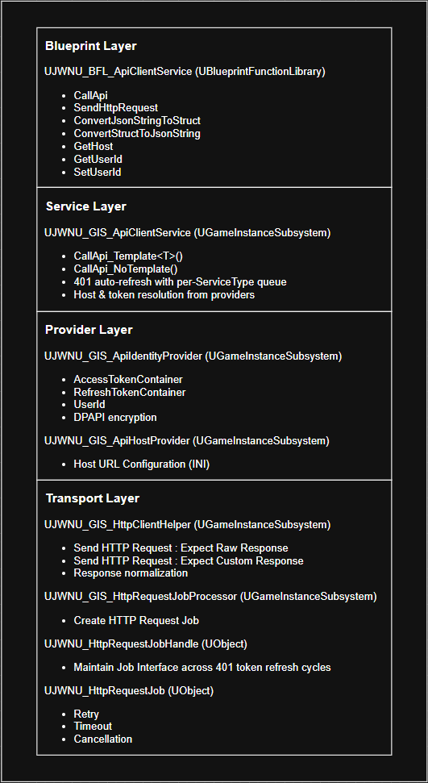
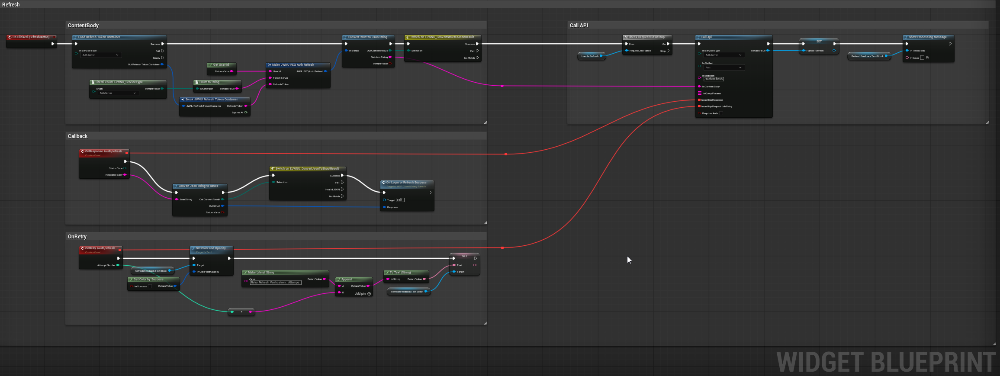

# JWNetworkUtility Plugin

> 부분 갱신 일자: 2026-09-24 — TestServer의 uv 가상환경·의존성 잠금과 실행 명령 추가.

> 부분 갱신 일자: 2026-09-24 — Content 밖의 TestServer로 이전하고 Uvicorn 실행 안내 추가.

> 부분 갱신 일자: 2026-09-23 — SSE HTTP 스트림과 C++·BP API, FastAPI 종단 테스트 추가. [SSE 사용 가이드](Docs/SSE.md).

A standalone Unreal Engine 5.6+ plugin providing a layered HTTP API client system with JWT authentication, automatic token refresh, retry/timeout handling, and Blueprint support.

**Engine:** Unreal Engine 5.6+ | **Author:** prayslaks | **Status:** Beta

## Table of Contents

- [JWNetworkUtility Plugin](#jwnetworkutility-plugin)
  - [Table of Contents](#table-of-contents)
  - [☕ Support](#-support)
  - [Features](#features)
  - [로컬 테스트 서버 실행](#로컬-테스트-서버-실행)
  - [Module Structure](#module-structure)
  - [Architecture](#architecture)
  - [Core Class List](#core-class-list)
  - [Usage](#usage)
    - [C++](#c)
    - [Blueprint](#blueprint)
  - [Documentation](#documentation)
  - [File Structure](#file-structure)
  - [License](#license)

## ☕ Support
If this project helped you, please consider buying me a coffee to support further development!

[](https://www.buymeacoffee.com/prayslaks)

## 로컬 테스트 서버 실행

프로젝트 루트에서 다음 명령으로 실행한다. FastAPI 앱은 `TestServer`에 있으며 Uvicorn이 HTTP·SSE 연결을 처리한다.

```powershell
cd Plugins/JWNetworkUtility/TestServer
uv sync --locked
uv run uvicorn main:app --host 127.0.0.1 --port 5000 --reload
```

[uv](https://docs.astral.sh/uv/getting-started/installation/)가 필요하다. 설치 직후 명령을 찾지 못하면 터미널을 다시 연다. `uv sync`가 Python 3.13의 `.venv`를 구성하고 `uv.lock`에 고정된 의존성을 설치한다. `uv run`이 환경을 사용하므로 수동 activate는 필요 없다. `pyproject.toml`과 `uv.lock`은 버전 관리하고 `.venv`는 제외한다. 의존성 변경은 `uv add`/`uv remove`로 관리하며, `requirements.txt`는 호환용 내보내기 파일이다. 변경 후 `uv export --locked --format requirements-txt --no-dev --no-emit-project --no-hashes --output-file requirements.txt`로 갱신한다.

실행 후 API 문서는 `http://127.0.0.1:5000/docs`, SSE 데모 URL은 `http://127.0.0.1:5000/sse/events`다. 종료는 `Ctrl+C`를 사용한다. 선택적으로 `.env.example`을 `.env`로 복사해 토큰 만료 시간·SMTP·로그 언어를 설정한다. 설정 파일은 `main.py` 옆에서 읽으며 환경변수가 우선한다. 테스트 세션은 메모리에 저장되므로 worker는 하나를 사용하고, `--reload`로 재시작되면 다시 로그인한다. SSE 검증 절차는 [SSE 사용 가이드](Docs/SSE.md)를 참고한다.

## Features

- SSE HTTP streaming: incremental UTF-8 event parsing, C++ typed callbacks, Blueprint events, bounded buffers, cancellation and JWT refresh integration. See [SSE guide](Docs/SSE.md).

- JWT Access/Refresh Token management (Windows DPAPI encryption)
- Automatic HTTP Request Retry with HTTP Request Job (5xx, timeout, network errors)
- Automatic token refresh and request retry queue on 401 responses
- Per-ServiceType host URL/token separation and Host Configuration Scalability (`GameServer`, `AuthServer`, `etc`)
- Raw HTTP Response Support
- Custom HTTP Response Normalization Support (non-2xx → consistent JSON structure)
- C++ template API (`CallApi_Template<T>`) and Blueprint Support
- Blueprint wildcard struct parsing (`CustomThunk`): JSON ↔ USTRUCT Conversion
- Pre-built request/response structs (`FJWNU_REQ_*`, `FJWNU_RES_*`) matching test server API
- Request Job Handle (`UJWNU_HttpRequestJobHandle`): exposes `Cancel`, `IsRunning`, `IsCancelled` to C++ and Blueprint; handle remains valid across 401 token refresh cycles

## Module Structure

| Module | Type | Description |
|---|---|---|
| `JWNetworkUtility` | Runtime | Core plugin — HTTP Job, HTTP Client, API Client, Token Provider, Host Provider |
| `JWNetworkUtilityTest` | Runtime | Test/demo module — API test actor |

## Architecture



## Core Class List

| Class | Base | Role |
|---|---|---|
| `UJWNU_GIS_ApiClientService` | GameInstanceSubsystem | High-level API: template parsing, 401 refresh queue |
| `UJWNU_GIS_HttpClientHelper` | GameInstanceSubsystem | Low-level HTTP: raw/normalized responses |
| `UJWNU_GIS_HttpRequestJobProcessor` | GameInstanceSubsystem | Job creation, query param encoding |
| `UJWNU_GIS_ApiIdentityProvider` | GameInstanceSubsystem | Token + UserId/SessionId storage, DPAPI encryption |
| `UJWNU_GIS_ApiHostProvider` | GameInstanceSubsystem | Host URLs from INI config |
| `UJWNU_HttpRequestJob` | UObject | Single request lifecycle: retry, timeout, cancel |
| `UJWNU_HttpRequestJobHandle` | UObject (BlueprintType) | Logical request handle: survives 401 refresh, exposes `Cancel`/`IsRunning`/`IsCancelled` |
| `UJWNU_BFL_ApiClientService` | BlueprintFunctionLibrary | Blueprint-exposed API |
| `UJWNU_BFL_AuthWidgetHelper` | BlueprintFunctionLibrary | Auth widget validation helpers (email, password) |

## Usage

### C++

```cpp
const auto Callback =
    FOnHttpRequestCompletedDelegate::CreateLambda([](const int32 StatusCode, const FString& ResponseBody)
    {
        PRINT_LOG(LogJWNU_Actor_ApiTest, Display, TEXT("Raw Response From Server : %s"), *ResponseBody);
    });

FString ProvidedHost;
if (UJWNU_GIS_ApiHostProvider::Get(GetWorld())->GetHost(EJWNU_ServiceType::AuthServer, ProvidedHost))
{
    return;
}

const FString URL = ProvidedHost + TEXT("/health");
const FString AuthToken = {};
const FString ContentBody = {};
const TMap<FString, FString> QueryParams = {};

UJWNU_GIS_HttpClientHelper::SendRequest_RawResponse(
    GetWorld(),
    EJWNU_HttpMethod::Get,
    URL,
    AuthToken,
    ContentBody,
    QueryParams,
    Callback);
```

→ See [C++ Usage](https://github.com/prayslaks/JWNetworkUtility/wiki/Cpp-Usage) for template API and job handle patterns.

### Blueprint



→ See [Blueprint Usage](https://github.com/prayslaks/JWNetworkUtility/wiki/Blueprint-Usage) for nodes, struct conversion, and handle usage.

## Documentation

Full documentation is available on the [Wiki](https://github.com/prayslaks/JWNetworkUtility/wiki).

| Page | Description |
|---|---|
| [Getting Started](https://github.com/prayslaks/JWNetworkUtility/wiki/Getting-Started) | Installation, build, first API call |
| [Architecture](https://github.com/prayslaks/JWNetworkUtility/wiki/Architecture) | Layer diagram, class list, request flow |
| [C++ Usage](https://github.com/prayslaks/JWNetworkUtility/wiki/Cpp-Usage) | Template API calls, job handle patterns |
| [Blueprint Usage](https://github.com/prayslaks/JWNetworkUtility/wiki/Blueprint-Usage) | Blueprint nodes, struct conversion, handle usage |
| [Authentication Flow](https://github.com/prayslaks/JWNetworkUtility/wiki/Authentication-Flow) | JWT lifecycle, 401 auto-refresh, token security |
| [Configuration](https://github.com/prayslaks/JWNetworkUtility/wiki/Configuration) | INI settings, console variables |
| [Test Server](https://github.com/prayslaks/JWNetworkUtility/wiki/Test-Server) | FastAPI test server setup and endpoints |
| [API Reference](https://github.com/prayslaks/JWNetworkUtility/wiki/API-Reference) | Enums, structs, delegates |

## File Structure

```
JWNetworkUtility/
├── Config/
│   ├── DefaultJWNetworkUtility.ini
│   └── FilterPlugin.ini
├── Content/
├── Docs/
├── Resources/
├── Source/
│   ├── JWNetworkUtility/
│   │   ├── Private/
│   │   │   ├── JWNetworkUtility.cpp
│   │   │   ├── JWNetworkUtilityTypes.cpp
│   │   │   ├── JWNetworkUtiltiyDelegates.cpp
│   │   │   ├── JWNU_BFL_ApiClientService.cpp
│   │   │   ├── JWNU_BFL_AuthWidgetHelper.cpp
│   │   │   ├── JWNU_GIS_ApiClientService.cpp
│   │   │   ├── JWNU_GIS_ApiHostProvider.cpp
│   │   │   ├── JWNU_GIS_ApiIdentityProvider.cpp
│   │   │   ├── JWNU_GIS_CustomCodeHelper.cpp
│   │   │   ├── JWNU_GIS_HttpClientHelper.cpp
│   │   │   ├── JWNU_GIS_HttpRequestJobProcessor.cpp
│   │   │   ├── JWNU_HttpRequestJob.cpp
│   │   │   └── JWNU_HttpRequestJobHandle.cpp
│   │   ├── Public/
│   │   │   ├── JWNetworkUtility.h
│   │   │   ├── JWNetworkUtilityDelegates.h
│   │   │   ├── JWNetworkUtilityTypes.h
│   │   │   ├── JWNU_BFL_ApiClientService.h
│   │   │   ├── JWNU_BFL_AuthWidgetHelper.h
│   │   │   ├── JWNU_GIS_ApiClientService.h
│   │   │   ├── JWNU_GIS_ApiHostProvider.h
│   │   │   ├── JWNU_GIS_ApiIdentityProvider.h
│   │   │   ├── JWNU_GIS_CustomCodeHelper.h
│   │   │   ├── JWNU_GIS_HttpClientHelper.h
│   │   │   ├── JWNU_GIS_HttpRequestJobProcessor.h
│   │   │   ├── JWNU_HttpRequestJob.h
│   │   │   └── JWNU_HttpRequestJobHandle.h
│   │   └── JWNetworkUtility.Build.cs
│   └── JWNetworkUtilityTest/
│       ├── Private/
│       │   ├── JWNetworkUtilityTest.cpp
│       │   └── JWNU_Actor_ApiTest.cpp
│       ├── Public/
│       │   ├── JWNetworkUtilityTest.h
│       │   └── JWNU_Actor_ApiTest.h
│       └── JWNetworkUtilityTest.Build.cs
├── .gitignore
├── .ptignore
├── CLAUDE.md
├── JWNetworkUtility.uplugin
├── LICENSE
├── print_tree.py
└── README.md
```

## License

See `LICENSE` file.
